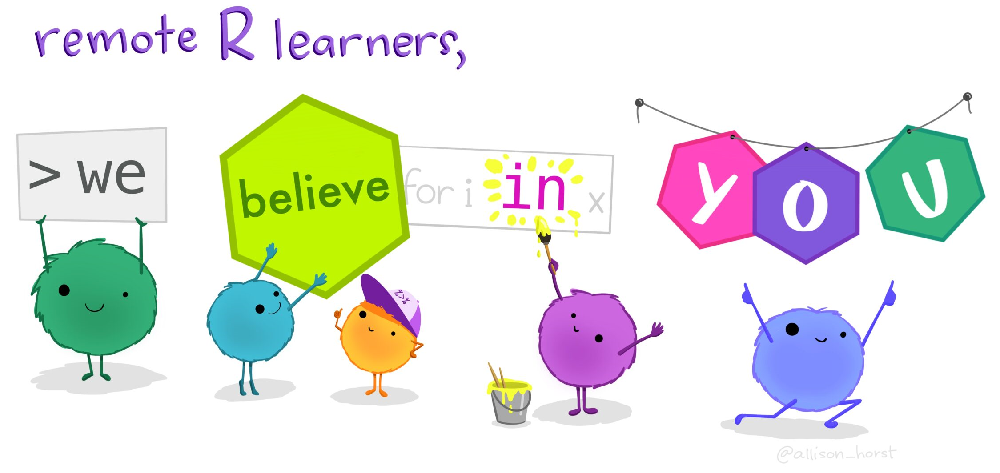
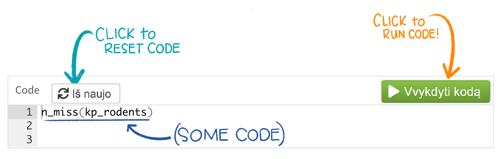
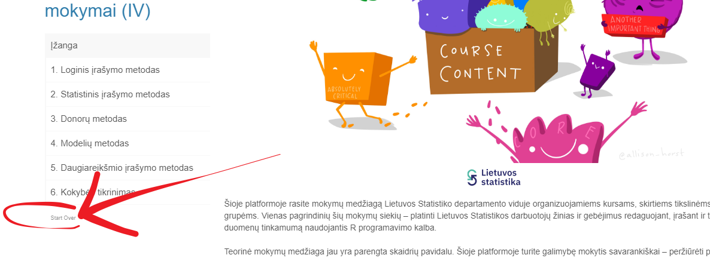
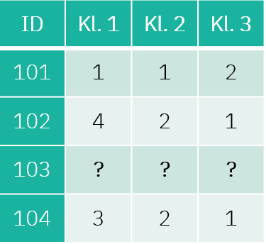
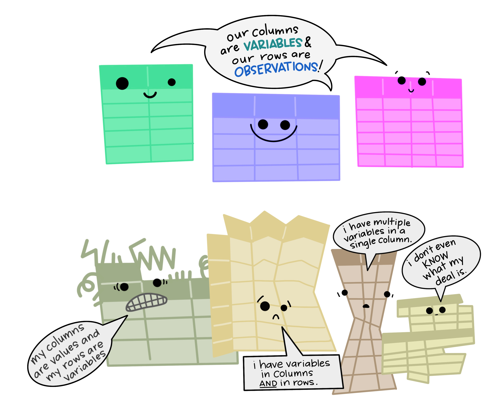
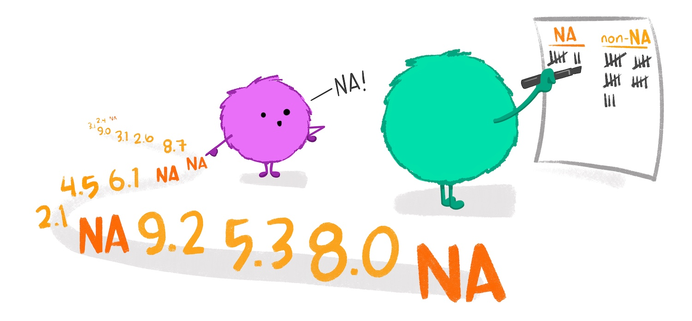

```{r setup, include=FALSE}

r = getOption("repos")
r["CRAN"] = "http://cran.us.r-project.org"
options(repos = r)


install.packages("rmarkdown")
install.packages("sortable")
install.packages("openxlsx")
install.packages("scales")
install.packages("readxl")
install.packages("tidyverse")
install.packages("remotes")
install.packages("fdm2id")
install.packages("plyr")
install.packages("SeleMix")
install.packages("vcd")
install.packages("VIM")
install.packages("dplyr")
install.packages("tidyr")
install.packages("janitor")
remotes::install_github("rstudio/gradethis")
remotes::install_github("rstudio/learnr")


library(learnr)
library(gradethis)
library(rmarkdown)
library(sortable)
library(openxlsx)
library(scales)
library(readxl)
library(tidyverse) 
library(fdm2id)
library(plyr)
library(SeleMix)
library(mice)
library(vcd)
library(VIM)
library(dplyr)
library(tidyr)
library(janitor)
knitr::opts_chunk$set(echo = FALSE)
tutorial_options(
  exercise.checker = gradethis::grade_learnr, 
  exercise.startover = "Iš naujo"
)

setwd("~/SwedenStuff/Lietuvos Statistika/LS - 1 skaidres")
viesbuciai <- read_excel("viesbuciai.xlsx")
```

## Įžanga

```{r, echo=FALSE, out.width="80%", fig.align = "center"}
  
```

```{r, echo=FALSE, out.width="10%", fig.align = "center"}
  
```

<br> Šioje platformoje rasite mokymų medžiagą Lietuvos Statistikos departamento viduje organizuojamiems mokymams, skirtiems tikslinėms darbuotojų grupėms. Vienas pagrindinių šių mokymų siekių -- platinti Lietuvos Statistikos darbuotojų žinias ir gebėjimus atlikti statistinių duomenų tinkamumo patvirtinimą, redagavimą, praleistų reikšmių įrašymą naudojantis R programavimo kalba. <br><br> Teorinė mokymų medžiaga jau yra parengta skaidrių pavidalu. Šioje platformoje turite galimybę mokytis savarankiškai -- peržiūrėti parengtą mokymų medžiagą, atlikti praktines užduotis. <br><br> Pirmojoje mokymų dalyje pateikiama naudinga informacija apie statistinių duomenų tinkamumo patvirtinimo, redagavimo ir įrašymo procesus:

-   **Klaidų rūšis**, pagal jų: <br>
    -   **Praleistų reikšmių (neatsakymų) tipą**
    -   **Pobūdį**
    -   **Kilmę**
    -   **Pasekmes** <br>
- **Duomenų formato ir struktūros tinkamumo patvirtinimą**
- **Duomenų turinio tinkamumo patvirtinimą**

#### Kaip tai veikia?

Rasite klausimų su atsakymų variantais:
```{r quiz0, fill = "orange", warning=FALSE, echo=FALSE}
quiz(caption = "",
  question("Kiek bus 5+5?", 
           answer("15"),
           answer("10", correct = TRUE), 
           answer("11"),
           answer("100"),
           correct = "Atsakymas teisingas!", 
           incorrect = "Atsakymas neteisingas",
  submit_button = "Pateikti", 
  try_again_button = "Iš naujo",
    allow_retry = TRUE
  )
)
```

Rasite klausimų, kuriuose reikalinga išrikiuoti atsakymus pagal tam tikrą eilę:

```{r ranking-example, warning=FALSE, echo=FALSE}
question_rank("<br> 1. 2+2 <br>
              2. 10+10 <br>
              3. 100-90 <br>
              4. 4*2",
  answer(skales <- c(
    "4",
    "20",
    "10",
    "8"),
  correct = TRUE), correct = "Teisingai!", 
  incorrect = "Bandykite dar kartą!",
  allow_retry = TRUE,
  random_answer_order = TRUE,
  submit_button = "Pateikti",
  options = sortable_options(), 
  try_again_button = "Iš naujo"
)
```

Taip pat, dirbsite su R, kur programavimo kodas veiks lyg dirbant tiesiogiai programoje. Paspauskite `Ctr+Enter` arba `Vykdyti kodą` mygtuką, kad įvykdytumėte programą.

```{r, echo=FALSE, out.width="85%", fig.align = "center"}
  
```

```{r example1, exercise=TRUE, exercise.lines = 4, exercise.cap = "R kodas"}
2+2
```

Jeigu nerandate tinkamo atsakymo kodo langelyje, galite pasinaudoti `Užuomina`, arba pasitikrinti atsakymą `Atsakymas` mygtuku. <br><br> Nepamirškite pateikti atsakymo paspausdami `Pateikti atsakymą` mygtuką, kur gausite išsamesnį komentarą apie savo kodą anglų kalba. 

```{r, echo=FALSE, out.width="85%", fig.align = "center"}
knitr::include_graphics("images/code_exercise_key.png")  
```

```{r example2, exercise=TRUE, exercise.lines = 3, exercise.cap = "R kodas"}
2+2==5
```

```{r example2-hint}
Ar suma teisinga?
```

```{r example2-solution}
2+2==4
```

```{r example2-check}
gradethis::grade_code()
```

Taip pat, prieš pradedant mokymus, svarbu nuspausti mygtuką `Perkrauti` (kaip pažymėta paveikslėlyje). Tai užtikrina, kad užduotys yra vykdomos nuo pradžių. Šį mygtuką galite naudoti kaskart, kai norite perkrauti mokymų medžiagą ir ją įvykdyti iš naujo.

```{r, echo=FALSE, out.width="100%", fig.align = "center"}
  
```

#### Iliustracijos

Ši mokymų platforma iliustruota paveikslėliais, kuriuos galite rasti [šiuo adresu](https://github.com/allisonhorst/stats-illustrations/). Naudojant šias iliustracijas, cituokite jas taip: "Artwork by @allison_horst".

**Sėkmės!**

## 1. Klaidų rūšys - praleistos reikšmės

#### 1.1. Peržiūrėkite žemiau pavaizduotą duomenų rinkinio fragmentą:

```{r, echo=FALSE, out.width="40%", fig.align = "left"}
  
```

```{r quiz1, warning=FALSE, echo=FALSE}
quiz(caption = "",
  question("Koks praleistų reikšmių tipas pavaizduotas?", 
           answer("Neatsakymas į tam tikrą klausimą"),
           answer("Populiacijos (imties) elemento neatsakymas", correct = TRUE),
              correct = "Tesingas atsakymas!", 
              incorrect = "Neteisingas atsakymas.",
              allow_retry = TRUE,
              try_again_button = "Iš naujo",
              submit_button = "Pateikti"),
  question("Koks sprendimo metodas taikomas šiai klaidai?",
           answer("Įrašymo metodas"), 
           answer("Elementų duomenų persvėrimo metodas", correct = TRUE),
              correct = "Tesingas atsakymas!", 
              incorrect = "Neteisingas atsakymas, šis metodas taikomas kitai klaidai.",
              allow_retry = TRUE,
              submit_button = "Pateikti",
              try_again_button = "Iš naujo")

)
```

```{r, echo=FALSE, out.width="80%", fig.align = "center"}
knitr::include_graphics("images/tidydata_3.jpg")  
```

## 2. Klaidų rūšys - priežastys

```{r, echo=FALSE, out.width="60%", fig.align = "center"}
  
```

#### 2.1. Kuriam klaidų tipui priklauso žemiau pateikti apibrėžimai:

```{r quiz2, warning=FALSE, echo=FALSE}
quiz(caption = "",
  question("Klaidos, kurias padaro klausėjas ar respondentas, taip pat tokios klaidos, kurios atsiranda dėl statistinio formuliaro trūkumų ar apklausos vykdymo būdo. Į neaiškiai suformuluotą klausimą gali būti pateiktas neteisingas ar netikslus atsakymas.",
    answer("Populiacijos sąrašo klaidos"),
    answer("Duomenų apdorojimo klaidos"),
    answer("Matavimo klaidos", correct = TRUE),
    correct = "Atsakymas teisingas!",
    incorrect = "Atsakymas neteisingas.",
    submit_button = "Pateikti", 
    try_again_button = "Iš naujo",
    allow_retry = TRUE
  ),
  question("Populiacijos sąrašas gali būti netikslus – nevisas arba (ir) perteklinis, t. y. jame gali trūkti kai kurių tikslo populiacijos elementų arba gali būti tokių elementų, kurie tikslo populiacijai nepriklauso. Taip pat populiacijos sąraše gali pasitaikyti kai kurių tikslo populiacijos elementų kintamųjų klasifikavimo klaidų.",
    answer("Populiacijos sąrašo klaidos", correct = TRUE),
    answer("Duomenų apdorojimo klaidos"),
    answer("Matavimo klaidos"),
    correct = "Atsakymas teisingas!",
    incorrect = "Atsakymas neteisingas.",
    submit_button = "Pateikti", 
    try_again_button = "Iš naujo",
    allow_retry = TRUE
  )

)
```

## 3. Klaidų rūšys - pobūdis

#### 3.1. Kuriam klaidų tipui priklauso žemiau pateikti pavyzdžiai:

```{r quiz3, warning=FALSE, echo=FALSE}
quiz(caption = "",
  question("Įvedant skaičių, per klaidą įvedama daugiau skaitmenų, arba įvedant 10 užmirštas 0, todėl reikšmė lieka lygi 1.",
    answer("Sisteminės klaidos"),
    answer("Atsitiktinės klaidos", correct = TRUE),
    correct = "Atsakymas teisingas!",
    incorrect = "Atsakymas neteisingas.",
    submit_button = "Pateikti", 
    try_again_button = "Iš naujo",
    allow_retry = TRUE
  ),
  question("Vietoje binarinės sistemos su 0 ir 1, reikšmės suvestos naudojantis reikšmėmis 1 ir 2, arba statistiniame formuliare prašoma nurodyti įmonės apyvartą (tūkst. eurų), o respondentai *nuolat* pateikia sumą eurais",
    answer("Sisteminės klaidos", correct = TRUE),
    answer("Atsitiktinės klaidos"),
    correct = "Atsakymas teisingas!",
    incorrect = "Atsakymas neteisingas.",
    submit_button = "Pateikti", 
    try_again_button = "Iš naujo",
    allow_retry = TRUE
  )

)
```

```{r, echo=FALSE, out.width="60%", fig.align = "center"}
  
```

## 4. Redagavimo procesas

Statistinių duomenų tinkamumo patvirtinimo, redagavimo ir įrašymo procesą sudaro trijų tipų funkcijos (subprocesai).

#### 4.1. Išrikiuokite procesų funkcijas pagal žemiau nurodytą jų pavadinimų eilę.

```{r ranking-procesas, warning=FALSE, echo=FALSE}
question_rank("<br> 1. Statistinių duomenų tinkamumo patvirtinimas <br>
              2. Reikšmingų statistinių duomenų klaidų nustatymas <br>
              3. Statistinių duomenų redagavimas ir įrašymas",
  answer(skales <- c(
    "Funkcijos, naudojamos statistiniams duomenims tikrinti ir potencialioms statistinių duomenų klaidoms nustatyti.",
    "Funkcijos, naudojamos identifikuoti reikšmingoms statistinių duomenų klaidoms ir atrinkti tiems stebėjimo vienetams ir (arba) laukams, kurie turi būti redaguoti.",
    "Funkcijos, naudojamos pakeisti statistinius duomenis taip, kad būtų pagerinta statistinių rezultatų kokybė."),
  correct = TRUE), correct = "Teisingai!", incorrect = "Bandykite dar kartą! Remkitės mokymų skaidrėmis.",
  allow_retry = TRUE,
  random_answer_order = TRUE,
  submit_button = "Pateikti",
  options = sortable_options(), 
  try_again_button = "Iš naujo"
)
```

#### 4.2. Pažymėkite 4 tinkamus atsakymo variantus:

```{r procesas, warning =FALSE, echo=FALSE}
question_checkbox("Nuo ko priklauso statistinių duomenų tinkamumo patvirtinimo, redagavimo ir įrašymo procesas?",
  answer("Statistinio tyrimo charakteristikų", correct = TRUE),
  answer("Statistinio tyrimo tikslų", correct = TRUE),
  answer("Prieinamos papildomos informacijos", correct = TRUE),
  answer("Turimų išteklių", correct = TRUE),
    answer("Esamų sąsajų su kitais duomenimis"),
    answer("Kitų duomenų valdytojo tinklų"),
    answer("Organizacijos ir joje tvarkomų asmens duomenų"),
    random_answer_order = TRUE,
    allow_retry = TRUE,
    try_again = "Bandykite iš naujo. Remkitės mokymų skaidrėmis.",
    submit_button = "Pateikti",
    try_again_button = "Iš naujo",
    correct = "Atsakymas teisingas!", 
    incorrect = "Bandykite dar kartą."
)
```

## 5. Formato ir struktūros tinkamumo patvirtinimas

Viena iš statistinių duomenų tinkamumo patvirtinimo funkcijų rūšių yra statistinių duomenų rinkinio formato ir struktūros tinkamumo patvirtinimas. Tikrinama statistinių duomenų rinkinio struktūros atitiktis keliamiems reikalavimams, pvz. stulpelių atskyrimo simboliai, stulpelių skaičius, duomenų tipas, ir kiti.

```{r, echo=FALSE, out.width="60%", fig.align = "center"}
knitr::include_graphics("images/meet_data.jpg")  
```

Šioje mokymų dalyje susipažinsite su duomenų rinkiniu [R Studio's "Learning R Survey"](https://github.com/rstudio/r-community-survey) kuris bus naudojamas kaip formato ir struktūros tikrinimo proceso pavyzdys. Kitose mokymų dalyse, dirbsite su nuasmenintais duomenimis naudojamais realiu laiku Lietuvos Statistikos Departamente ir kitur pasaulyje.

#### 5.1. Parsisiųskite ir peržvelkite pavyzdinį duomenų rinkinį ir pagalvokite ar jiems reikalingas tinkamumo patvirtinimas, redagavimas ir įrašymas. Jei taip - kodėl? <br><br> *Atkreipkite dėmesį, kitus stulpelius galite peržiūrėti su rodyklėmis prie pavadinimų.*

```{r duomenu-rinkinys, exercise=TRUE, exercise.lines = 3, exercise.cap = "R kodas", warning=FALSE, echo=FALSE}
df <- read.csv("https://github.com/rstudio/learning-r-survey/raw/master/2019/data/2019%20English%20R%20Community%20Survey%20Responses.csv", fileEncoding = "UTF-8")

```

```{r duomenu-rinkinys-hint}
Norėdami apžvelgti duomenų rinkinį tiesiog įveskite jo pavadinimą naujoje eilutėje ir paspauskite 'Vyktydti kodą'.
```

```{r duomenu-rinkinys-solution}
df <- read.csv("https://github.com/rstudio/learning-r-survey/raw/master/2019/data/2019%20English%20R%20Community%20Survey%20Responses.csv", fileEncoding = "UTF-8")
df
```

#### 5.2. Apžvekite pirmųjų 5 stulpelių duomenų rinkinio **struktūrą**.

```{r duomenu-rinkinys-1-setup}
df <- read.csv("https://github.com/rstudio/learning-r-survey/raw/master/2019/data/2019%20English%20R%20Community%20Survey%20Responses.csv", fileEncoding = "UTF-8")
```

```{r duomenu-rinkinys-1, exercise=TRUE, exercise.lines = 2, exercise.cap = "R kodas", warning=FALSE, echo=FALSE}
___(df[1:5])
```

```{r duomenu-rinkinys-1-hint}
Naudokite str() funkciją.
```

```{r duomenu-rinkinys-1-solution}
str(df[1:5])
```

```{r duomenu-rinkinys-1-check}
gradethis::grade_code()
```

Matomai, kintamųjų pavadinimai yra per ilgi ir neinformatyvūs - su tokiais dirbti sunku.

Viena pirmųjų užduočių - pervadinti kintamųjų pavadinimus į patogesnius. Tam atlikti naudosimės funkcija `rename()`, kuri yra viena iš daugelio **dplyr** paketo funkcijų.


*Dirbant savarankiškai, **dplyr** paketą turėsite parsisiųsti.*

#### 5.3. Sugalvokite naujus 2-tro ir 3-čio kinamųjų pavadinimus ir pakeiskite jais ilgus pradinius kintamųjų pavadinimus. Patikrinkite, ar pavyko kodo vykdymas su `names(df[2:3])`.

```{r duomenu-rinkinys-2-setup}
df <- read.csv("https://github.com/rstudio/learning-r-survey/raw/master/2019/data/2019%20English%20R%20Community%20Survey%20Responses.csv", fileEncoding = "UTF-8")
```

```{r duomenu-rinkinys-2, exercise=TRUE, exercise.lines = 7, exercise.cap = "R kodas", warning=FALSE, echo=FALSE}
df <- df %>% # šiai funkcijai atlikti reikalingas dplyr paketas
  dplyr::rename("_____" = "How.would.you.rate.your.level.of.experience.using.R.", 
                "_____" = "Compared.with.other.technical.topics.you.ve.learned.in.school.and.on.the.job..on.a.scale.of.1.to.5..how.difficult.do.you.expect.learning.R.to.be.")
```

```{r duomenu-rinkinys-2-hint}
Užpildykite tuščias vietas. Savo nuožiūra duokite pasirinktus pavadinimus pirmiems dviems kintamiesiems. 
```

```{r duomenu-rinkinys-2-solution}
df <- df %>% # šiai funkcijai atlikti reikalingas dplyr paketas
   dplyr::rename("Qr_experience" = "How.would.you.rate.your.level.of.experience.using.R.", 
                 "Qr_difficulty" = "Compared.with.other.technical.topics.you.ve.learned.in.school.and.on.the.job..on.a.scale.of.1.to.5..how.difficult.do.you.expect.learning.R.to.be.")
```

Turint omenyje, kad esama 52-jų kintamųjų, užtruktumėme pernelyg ilgai perrašinėdami jų pavadinimus rankiniu būdu. Laimei, egzistuoja funkcija `names()` leidžianti automatiškai perrašyti kintamųjų pavadinimus identiškai pagal kito duomenų rinkinio kintamuosius. <br>

Taip pat, R Studio mums duoda šiokią tokią pagalbą: [kintamųjų pavadinimų sąrašą](https://github.com/rstudio/r-community-survey/blob/master/2019/Learning%20R%20Internet%20Survey%20-%20Question%20Names.tsv), kuriuo naudojantis galime automatizuoti pavadinimų perrašymą.


#### 5.4. Atsidarykite su kintamųjų pavadinimų sąrašu susijusį *.tsv* failą **(1 eilutė)**. Pasinaudokite `names()` funkcija, kad pakeistumėte `df` kintamųjų pavadinimus **(3 eilutė)**. Su `names(df1[1:10])`, patikrintike, ar pavyko **(5 eilutė)**.

```{r duomenu-rinkinys-3-setup}
df <- read.csv("https://github.com/rstudio/learning-r-survey/raw/master/2019/data/2019%20English%20R%20Community%20Survey%20Responses.csv", fileEncoding = "UTF-8")
```

```{r duomenu-rinkinys-3, exercise=TRUE, exercise.lines = 7, exercise.cap = "R kodas", warning=FALSE, echo=FALSE}
df1 <- read_tsv("https://raw.githubusercontent.com/rstudio/learning-r-survey/master/2019/data/2019-english-question-names-only.tsv", show_col_types = FALSE)

___(df) <- ___(df1)

names(df1[_:__])
```

```{r duomenu-rinkinys-3-hint}
Pervadinant, 3-čioje eilutėje tuščiose reikšmėse įrašykite names(). Galiausiai, tikrintant, ar pavyko, pasirinkite pirmuosius 10 kintamųjų, t.y. `1:10` (5-toje eilutėje).
```

```{r duomenu-rinkinys-3-solution}
df1 <- read_tsv("https://raw.githubusercontent.com/rstudio/learning-r-survey/master/2019/data/2019-english-question-names-only.tsv", show_col_types = FALSE)

names(df) <- names(df1)

names(df1[1:10])
```

```{r duomenu-rinkinys-3-check}
gradethis::grade_code()
```

Prieš tikrindami duomenų rinkinio `df` reikšmes, pasirūpinkime, kad kintamųjų pavadinimai prasidėtų mažąja raide. Taip standartizuodami užtikrinsime, kad ateityje išvengsime galimų klaidų.

Jeigu naudosite funkciją savarankiškai, nepamirškite instaliuoti **janitor** paketą.

#### 5.5. Pakeiskite kintamųjų pavadinimus į mažąsias raides.

```{r duomenu-rinkinys-4-setup}
df <- read.csv("https://github.com/rstudio/learning-r-survey/raw/master/2019/data/2019%20English%20R%20Community%20Survey%20Responses.csv", fileEncoding = "UTF-8")

df1 <- read_tsv("https://raw.githubusercontent.com/rstudio/learning-r-survey/master/2019/data/2019-english-question-names-only.tsv")

names(df) <- names(df1)
```

```{r duomenu-rinkinys-4, exercise=TRUE, exercise.lines = 4, exercise.cap = "R kodas", warning=FALSE, echo=FALSE}
df <- df %>% 
  ___::clean_names()

names(df[1:10])
```

```{r duomenu-rinkinys-4-hint}
Tuščioje vietoje įveskite paketo pavadinimą.
```

```{r duomenu-rinkinys-4-solution}
df <- df %>% 
  janitor::clean_names()

names(df[1:10])
```

```{r duomenu-rinkinys-4-check}
gradethis::grade_code()
```

#### 5.6. Patikrinkite, kokiai klasei ar duomenų tipui priklauso visi duomenų rinkinio `df` kintamasis `qpeople`.

```{r duomenu-rinkinys-5-setup}
df <- read.csv("https://github.com/rstudio/learning-r-survey/raw/master/2019/data/2019%20English%20R%20Community%20Survey%20Responses.csv", fileEncoding = "UTF-8")

df1 <- read_tsv("https://raw.githubusercontent.com/rstudio/learning-r-survey/master/2019/data/2019-english-question-names-only.tsv")

names(df) <- names(df1)

df <- df %>% 
  janitor::clean_names()
```


```{r duomenu-rinkinys-5, exercise=TRUE, exercise.lines = 4, exercise.cap = "R kodas", warning=FALSE, echo=FALSE}
class(___$___)
```

```{r duomenu-rinkinys-5-hint}
Galite naudoti funkciją class()
```

```{r duomenu-rinkinys-5-solution}
class(df$qpeople)
```


#### 5.7. Galiausiai, patikrinkite, kokiai klasei ar duomenų tipui priklauso visi kintamieji.

```{r duomenu-rinkinys-6-setup}
df <- read.csv("https://github.com/rstudio/learning-r-survey/raw/master/2019/data/2019%20English%20R%20Community%20Survey%20Responses.csv", fileEncoding = "UTF-8")

df1 <- read_tsv("https://raw.githubusercontent.com/rstudio/learning-r-survey/master/2019/data/2019-english-question-names-only.tsv")

names(df) <- names(df1)

df <- df %>% 
  janitor::clean_names()
```

```{r duomenu-rinkinys-6, exercise=TRUE, exercise.lines = 4, exercise.cap = "R kodas", warning=FALSE, echo=FALSE}
lapply(___, ___)
```

```{r duomenu-rinkinys-6-hint}
Galite naudoti funkciją lapply(list, function)
```

```{r duomenu-rinkinys-6-solution}
lapply(df, class)
```

```{r duomenu-rinkinys-6-check}
gradethis::grade_code()
```

```{r class, warning=FALSE, echo=FALSE}
quiz(caption = "",
  question("Kokiai klasei priklauso kintamasis *qpeople*?", 
           answer("Sveikojo skaičiaus"),
           answer("Simbolio"),
           answer("Eilutės"),
           answer("Skaitinio", correct = TRUE),
              correct = "Tesingas atsakymas!", 
              incorrect = "Neteisingas atsakymas.",
              allow_retry = TRUE,
              submit_button = "Pateikti")
)
```

## 6. Turinio tinkamumo patvirtinimas

Kita iš statistinių duomenų tinkamumo patvirtinimo funkcijų rūšių yra statistinių duomenų rinkinio turinio (loginio ir suderinamumo) tinkamumo patvirtinimas. Suderinamumo tikrinimas:

-   statistinių duomenų rinkinio viduje (šios mokymų skilties užduotys);
-   su kitais duomenų rinkiniais iš vieno duomenų šaltinio (pvz., lyginami skirtingų laikotarpių statistinio tyrimo duomenys);
-   su kitais duomenų rinkiniais iš skirtingų duomenų šaltinių, statistikos sričių (pvz., lyginami skirtingų statistinių tyrimų duomenys).

Toliau, kaip pavyzdį, atliksime dalies duomenų akivaizdžių klaidų ir reikšmių kombinacijų loginio nuoseklumo vertinimą. <br><br>

```{r, echo=FALSE, out.width="60%", fig.align = "center"}
  
```

Į jūsų aplinką jau įvestas naujas duomenų rinkinys pavadinimu `viesbuciai`. Šio duomenų rinkinio turinys susideda iš įvairių miesto viešbučių apie jų klientus renkamos informacijos, pvz. viešbučio pavadinimo, laiko nuo kambario rezervacijos iki apsilankymo, kiek naktų apsistota, vaikų/suaugusiųjų skaičiaus ir pan.

#### 6.1. Pirmiausia, peržvelkite duomenų rinkinį(**1 eilutė**).  <br> Patvirtinkite, kad teisingai suvestos laiko iki rezervacijos reikšmės (dienų iki rezervacijos pradžios - `dienos_iki` ir valandų iki rezervacijos pradžios - `valandos_iki`), t.y. jeigu įvesta 1 diena, turėtų atitinkamai būti 24val, 2 dienos - 48 val. ir t.t (**3-5 eilutės**).

```{r dienos-valandos, exercise=TRUE, exercise.lines = 6, exercise.cap = "R kodas", warning=FALSE, echo=FALSE}
View(_____)

nr <- which(viesbuciai$_____!=viesbuciai$_____*24)

viesbuciai[nr,]
```

```{r dienos-valandos-hint}
Peržvelkite viesbuciai duomenis. Įveskite 2 tikrinamus kintamuosius: valandos_iki ir dienos_iki. Pagalvokite, kuris iš šių kintamųjų turėtų būti padaugintas iš 24, kad būtų galima juos sulyginti. 
```

```{r dienos-valandos-solution}
View(viesbuciai)

nr <- which(viesbuciai$valandos_iki!=viesbuciai$dienos_iki*24)

viesbuciai[nr,]

```

```{r dienos-valandos-check}
gradethis::grade_code()
```

```{r dienos-valandos-klaida, warning=FALSE, echo=FALSE}
quiz(caption = "",
  question("Kokią klaidą suradote?", 
           answer("Dienų ir valandų skaičius apkeistas vietomis"),
           answer("Trūksta dienų skaičiaus įvesties"), 
           answer("Trūksta valandų skaičiaus įvesties"),
           answer("Dienų ir valandų skaičius sutampa", correct = TRUE),
           correct = "Atsakymas teisingas! Šios išskirtys yra klaidingai įvesta viena iš dviejų kintamųjų reikšmė. Tolimesnėse mokymų dalyse aptarsime, kaip klaidingos ir praleistos reikšmės tvarkomos remiantis statistinių duomenų redagavimo taisyklėmis.", 
           incorrect = "Atsakymas neteisingas. Įsigilinkite į aukščiau kodo langelyje esančio atsakymo reikšmę.",
  submit_button = "Pateikti", 
  try_again_button = "Iš naujo",
    allow_retry = TRUE
  )
)
```

Kitoje užduotyje tikrinsite, ar sutampa informacija apie rezervacijos statusą bei atšaukimą.

#### 6.2. Pirmiausia, patikrinkite, kokios yra unikalios `rezervacijos_statusas` ir `atsaukta` reikšmės. Pagalvokite, kokia logika remiantis šie kintamieji galėtų būti susiję.

```{r reservation-status-1, exercise=TRUE, exercise.lines = 6, exercise.cap = "R kodas", warning=FALSE, echo=FALSE}
unique(viesbuciai[,c("___", "___")])
```

```{r reservation-status-1-hint}
Tuščiose vietose įrašykite ieškomų kintamųjų pavadinimus. 
```

```{r reservation-status-1-solution}
unique(viesbuciai[,c("rezervacijos_statusas", "atsaukta")])
```

```{r reservation-status-1-check}
gradethis::grade_code()
```

Remiantis jūsų gauta informacija, kintamasis `atsaukta` yra dvireikšmis, t.y. "0" (rezervacija neatšaukta) bei "1" (rezervacija atšaukta ir neįvykdyta).

`Rezervacijos_statusas` turi tris reikšmes: `"Atšauktas"`, `"Registruotas"`, `"Nepasirodė"`.

```{r turinio_reiksme, warning=FALSE, echo=FALSE}
quiz(caption = "",
  question("Kaip tikrinsite, ar `rezervacijos_statusas` ir `atsaukta` įvestis teisinga (turinys tinkamas)?", 
           answer("Vienetinė `Atšauktas` reikšmė turėtų atitikti 'Atšauktas' ir 'Nepasirodė' `Rezervacijos_statusas` reikšmes.", correct = TRUE),
           answer("Vienetinė `Atšauktas` reikšmė turėtų atitikti 'Registruotas'  `Rezervacijos_statusas` reikšmę."), 
           answer("Nulinė `Atšauktas` reikšmė turėtų atitikti 'Atšauktas' ir 'Nepasirodė' `Rezervacijos_statusas` reikšmes."),
           correct = "Atsakymas teisingas! Jeigu rezervacija atšaukta, vadinasi rezervacijos statusas turėtų indikuoti rezervacijos atšaukimą arba nepasirodymą.", 
           incorrect = "Atsakymas neteisingas",
  submit_button = "Pateikti", 
  try_again_button = "Iš naujo",
    allow_retry = TRUE
  )
)
```

#### 6.3. Pasirinkta logika, patikrinkite, ar `rezervacijos_statusas` ir `atsaukta` turiniai tinkamai įrašyti ir vienas kitam neprieštarauja.

```{r turinio-tinkamumas, exercise=TRUE, exercise.lines = 6, exercise.cap = "R kodas", warning=FALSE, echo=FALSE}

```

```{r turinio-tinkamumas-hint}
Galimi daug skirtingų sprendimo būdų. Pavyzdžiui, pagal aukščiau apibrėžtą logiką, patikrinti, ar nėra eilučių, kurioms `atsaukta` yra 1, bet `rezervacijos_statusas` yra `Registruotas`, arba suma neatšauktų užsakymų (0) sutampa su suma registruotų užsakymų `Registruotas`. 
```

```{r turinio-tinkamumas-solution}
sum(viesbuciai$atsaukta==1 & viesbuciai$rezervacijos_statusas == "Registruotas")
```

```{r turinio-tinkamumas-2, warning=FALSE, echo=FALSE}
quiz(caption = "",
  question("Ar `rezervacijos_statusas` ir `atsaukta` turiniai tinkamai įrašyti ir vienas kitam neprieštarauja?", 
           answer("Taip", correct = TRUE),
           answer("Ne, reikalingas duomenų redagavimas/perrašymas."),
           correct = "Atsakymas teisingas! Neatšauktų ir registruotų užsakymų skaičiai sutampa, tad šių kintamųjų turinys tinkamas galutinių duomenų tolimesnei analizei.", 
           incorrect = "Atsakymas neteisingas, dar kartą patikrinkite, ar neatšauktų ir registruotų užsakymų skaičiai sutampa.",
  submit_button = "Pateikti", 
  try_again_button = "Iš naujo",
    allow_retry = TRUE
  )
)
```

```{r, echo=FALSE, out.width="10%", fig.align = "right"}
knitr::include_graphics("images/learnr.png")  
```
