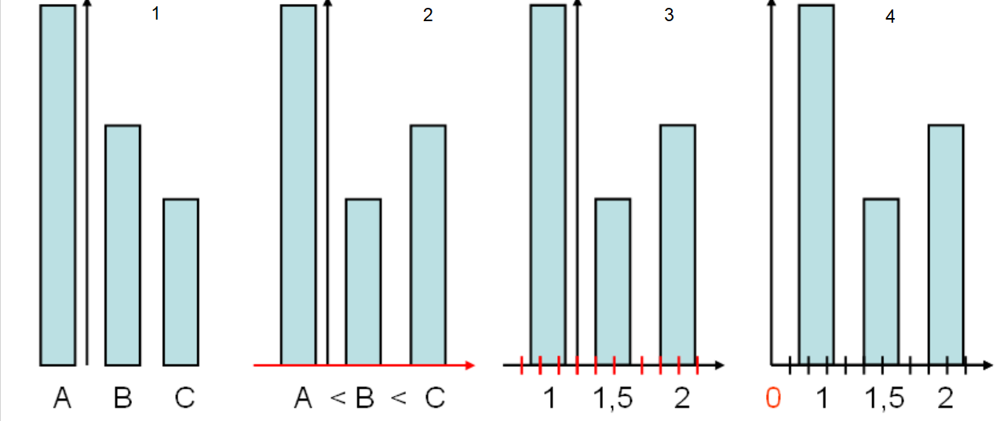
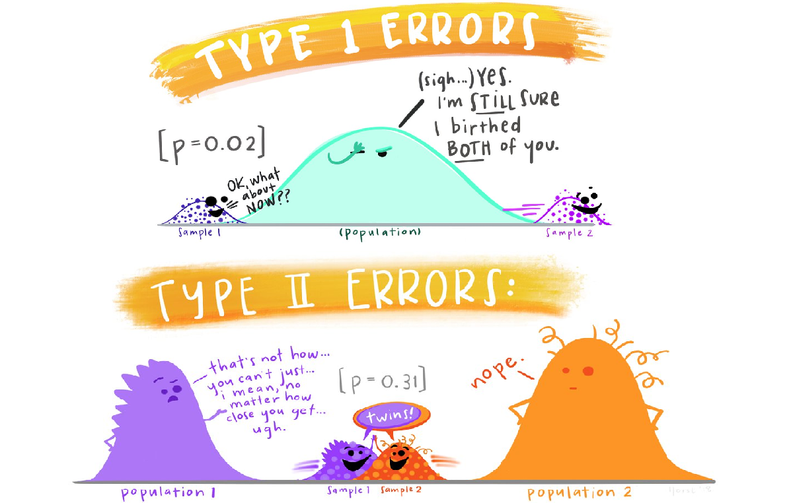
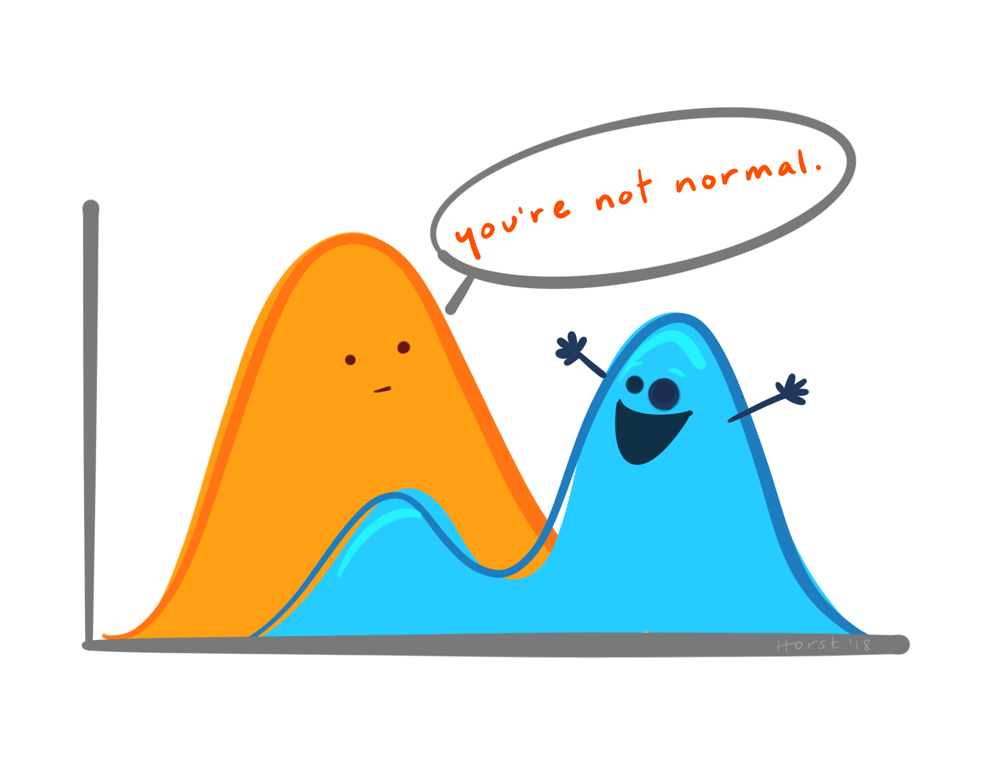

```{r setup, include=FALSE}


r = getOption("repos")
r["CRAN"] = "http://cran.us.r-project.org"
options(repos = r)


install.packages("rmarkdown")
install.packages("sortable")
install.packages("openxlsx")
install.packages("scales")
install.packages("readxl")
install.packages("tidyverse")
install.packages("remotes")
remotes::install_github("rstudio/gradethis")
remotes::install_github("rstudio/learnr")

library(learnr)
library(gradethis)
library(rmarkdown)
library(sortable)
library(openxlsx)
library(scales)
library(readxl)
library(tidyverse) 
knitr::opts_chunk$set(echo = FALSE)
tutorial_options(
  exercise.checker = gradethis::grade_learnr, 
  exercise.startover = TRUE
)
options(scipen=999)
setwd("~/SwedenStuff/Lietuvos Statistika/LS - 2 skaidres")
# Create objects use throughout tutorial:
# Read in data as `duomenys`
duomenys <- read_excel("Duomenys.xlsx")
names(duomenys) <- c("kodas9", "evrk2", "imtis", "viso", "val", "viso_prm_ket", "viso_pr_ket", "pvm", "DSK")

```

## Įžanga

```{r, echo=FALSE, out.width="50%", fig.align = "center"}
knitr::include_graphics("images/introtoR.png")  
```
```{r, echo=FALSE, out.width="10%", fig.align = "center"}
knitr::include_graphics("images/LS_logo.svg")  
```

<br>
Šioje platformoje rasite mokymų medžiagą Lietuvos Statistikos departamento viduje organizuojamiems mokymams, skirtiems tikslinėms darbuotojų grupėms. Vienas pagrindinių šių mokymų siekių – platinti Lietuvos Statistikos darbuotojų žinias ir gebėjimus atlikti statistinių duomenų tinkamumo patvirtinimą, redagavimą, praleistų reikšmių įrašymą naudojantis R programavimo kalba. <br><br> Teorinė mokymų medžiaga jau yra parengta skaidrių pavidalu. Šioje platformoje turite galimybę mokytis savarankiškai – peržiūrėti parengtą mokymų medžiagą, atlikti praktines užduotis.
<br><br> Antrojoje mokymų dalyje pateikiama naudinga informacija apie:

- **Kintamuosius**: ir jų tipus pagal reiškinio kilmę ir matavimų skalę.
- **Statistines hipotezes**: (ne)atmetimo klaidas, taisykles ir statistinį reikšmingumą.
- **Skirstinius**: ir kaip juos vizualiai pateikti R programavimo kalba.
- **Duomenų tikrinimą**: ir tikrinimo taisykles.
- **Išsiskiriančias reikšmes**: normaliojo skirstinio grafike ir kaip jas apdoroti.
- **Rėžių taisyklę**: ir kaip ją apskaičiuoti naudojantis R.
- **Istorinę (palyginimo) taisyklę**: bei kam ją taikyti.
 <br><br>

#### Kaip tai veikia?

Rasite klausimų su atsakymų variantais:
```{r quiz0, fill = "orange", warning=FALSE, echo=FALSE}
quiz(caption = "",
  question("Kiek bus 5+5?", 
           answer("15"),
           answer("10", correct = TRUE), 
           answer("11"),
           answer("100"),
           correct = "Atsakymas teisingas!", 
           incorrect = "Atsakymas neteisingas",
  submit_button = "Pateikti", 
  try_again_button = "Iš naujo",
    allow_retry = TRUE
  )
)
```

Rasite klausimų, kuriuose reikalinga išrikiuoti atsakymus pagal tam tikrą eilę:

```{r ranking-example, warning=FALSE, echo=FALSE}

question_rank("<br>1. 2+2 <br>
              2. 10+10 <br>
              3. 100-90 <br>
              4. 4*2",
  answer(skales <- c(
    "4",
    "20",
    "10",
    "8"),
  correct = TRUE), correct = "Teisingai!", incorrect = "Bandykite dar kartą!",
  allow_retry = TRUE,
  random_answer_order = TRUE,
  submit_button = "Pateikti",
  options = sortable_options(), 
  try_again_button = "Iš naujo"
)
```

Taip pat, dirbsite su R, kur programavimo kodas veiks lyg dirbant tiesiogiai programoje. Paspauskite `Ctr+Enter` arba `Vykdyti kodą` mygtuką, kad įvykdytumėte programą. 

```{r, echo=FALSE, out.width="85%", fig.align = "center"}
knitr::include_graphics("images/code_chunk_key.png")  
```

```{r example1, exercise=TRUE, exercise.lines = 4, exercise.cap = "R kodas"}
2+2
```

Jeigu nerandate tinkamo atsakymo kodo langelyje, galite pasinaudoti `Užuomina` , arba pasitikrinti atsakymą `Atsakymas` mygtuku. <br><br> Nepamirškite pateikti atsakymo paspausdami `Pateikti atsakymą` mygtuką, kur gausite išsamesnį komentarą apie savo kodą anglų kalba. 

```{r, echo=FALSE, out.width="85%", fig.align = "center"}
knitr::include_graphics("images/code_exercise_key.png")  
```

```{r example2, exercise=TRUE, exercise.lines = 3, exercise.cap = "R kodas"}
2+2==5
```

```{r example2-hint}
Ar suma teisinga?
```

```{r example2-solution}
2+2==4
```

```{r example2-check}
gradethis::grade_code()
```

Taip pat, prieš pradedant mokymus, svarbu nuspausti mygtuką `Perkrauti` (kaip pažymėta paveikslėlyje). Tai užtikrina, kad užduotys yra vykdomos nuo pradžių. Šį mygtuką galite naudoti kaskart, kai norite perkrauti mokymų medžiagą ir ją įvykdyti iš naujo.

```{r, echo=FALSE, out.width="100%", fig.align = "center"}
knitr::include_graphics("images/start_over.png")  
```

#### Iliustracijos
Ši mokymų platforma iliustruota paveikslėliais, kuriuos galite rasti [šiuo adresu](https://github.com/allisonhorst/stats-illustrations/). Naudojant šias iliustracijas, cituokite jas taip: “Artwork by @allison_horst”.

**Sėkmės!**

## 1. Kintamieji

```{r, echo=FALSE, out.width="80%", fig.align = "center"}
knitr::include_graphics("images/types.jfif")  
```

#### 1.1. Kokiam kintamųjų tipui priskiriami duomenys gauti žemiau nurodytame aprašyme?

```{r quiz1, fill = "orange", warning=FALSE, echo=FALSE}
quiz(caption = "",
  question("Tyrime apie muzikos poveikį žmonėms, kenčiantiems nuo lėtinio skausmo, visi rezultatai gauti naudojant klausimynus, vertinančius skausmą skalėje nuo 1 iki 10.", 
           answer("Kokybiams (kategoriniams)"),
           answer("Kiekybiniams", correct = TRUE), 
           correct = "Atsakymas teisingas! Kiekybiniai kintamieji parodo, kiek tiriamo požymio turi populiacijos elementas, pvz. pajamos, amžius, įmonės darbuotojų skaičius ir pan.", 
           incorrect = "Atsakymas neteisingas. Šie kintamieji nusako dydžius, kurių neįmanoma įvertinti skaičiais, pvz., lytis, išsilavinimas, ekonominės veiklos rūšis ir pan.
",
  submit_button = "Pateikti", 
  try_again_button = "Iš naujo",
    allow_retry = TRUE
  ),
  question("Norime parduoti produktą ir esame suinteresuoti žinoti šeimyninę padėtį. Norėdami tai padaryti, priskiriame 1 - vienišui, 2 - vedusiam, 3 - išsiskyrusiam, 4 - partneriui ir 5 - kitiems tyrimo dalyviams.", 
           answer("Kokybiams (kategoriniams)", correct = TRUE),
           answer("Kiekybiniams"), 
           correct = "Atsakymas teisingas! Kokybiniai (arba kategoriniai) kintamieji nusako dydžius, kurių neįmanoma įvertinti skaičiais, pvz. lytis, išsilavinimas, ekonominės veiklos rūšis ir pan. Kokybinio kintamojo reikšmes koduojant skaitmenimis, kintamojo prasmė nesikeičia.", 
           incorrect = "Atsakymas neteisingas. Kiekybiniai kintamieji parodo, kiek tiriamo požymio turi populiacijos elementas, pvz. pajamos, amžius, įmonės darbuotojų skaičius ir pan.",
  allow_retry = TRUE,
  submit_button = "Pateikti", 
  try_again_button = "Iš naujo"
  )
)
```

```{r, echo=FALSE, out.width="80%", fig.align = "center"}
knitr::include_graphics("images/types2.png")  
```

#### 1.2. Kuriam kiekybinio kintamojo tipui priklauso šie duomenų pavyzdžiai:
```{r quiz2, warning=FALSE, echo=FALSE}
quiz(caption = "",
   question("Duomenų įvedimo klaidų skaičius Lietuvos Statistikos Departamente; nelaimingų atsitikimų skaičius Vilniuje?", 
           answer("Tolydiesiems"),
           answer("Diskretiesiems", correct = TRUE), 
           correct = "Atsakymas teisingas! Kiekybinis kintamasis, kurio reikšmių skirtumas yra ne mažesnis už tam tikrą minimalų pokytį, vadinamas diskrečiuoju kintamuoju (pvz., įmonės darbuotojų skaičius).", 
           incorrect = "Neteisingas atsakymas. Tolydieji kintamieji įgyja reikšmes neskaičioje skalėje
ir jų įgyjamų reikšmių sunumeruoti negalima.
",
    allow_retry = TRUE,
  submit_button = "Pateikti", 
  try_again_button = "Iš naujo"
  )
)
```

#### 1.3. Kintamųjų tipai pagal matavimo skalę

Kintamuosius galima klasifikuoti pagal naudojamą matavimų skalės tipą:

- **Pavadinimų (arba nominalioji, klasifikavimo) skalė**: pagal kintamojo reikšmes, gautas naudojant pavadinimų skalę, tyrimo objektus galima tik klasifikuoti, t. y. priskirti vienai ar kitai klasei. Objektams arba objektų klasėms priskiriami simboliai (kategorijų kodai). Jie tarpusavyje nepalyginami (net tuo atveju, kai yra skaičiai).  
- **Rangų (arba tvarkos, eilės) skalė**: ši skalė naudojama tada, kai galima nustatyti objektų tiriamo požymio skirtumus ir pagal tai objektus išrikiuoti į eilę. Pagal ranginių kintamųjų reikšmes objektus galima ne tik skirstyti į klases, bet ir jas sutvarkyti. Ar didesnis rangas (sutvarkytos eilės numeris) atitinka didesnį požymio kiekį ar svarbą, priklauso nuo rangų priskyrimo taisyklės. Rangai tarpusavyje gali būti lyginami tik eiliškumui nustatyti
- **Intervalų skalė**: matavimams naudojant intervalų skalę, objektus galima ne tik klasifikuoti, tvarkyti, bet ir kiekybiškai įvertinti skirtumus. Intervaliniai duomenys visada skaitiniai. Skirtumas (intervalas) tarp dviejų kintamojo reikšmių rodo, kiek daugiau ar mažiau matuojamo požymio yra viename tyrimo objekte, palyginti su kitu. Nulinis taškas intervalų skalėje yra laisvai pasirenkamas. 
- **Santykių skalė**: nuo intervalų skalės skiriasi tik tuo, kad joje yra apibrėžta absoliuti atskaitos pradžia. Šioje skalėje yra absoliutusis nulis, t.y. nulinis taškas, rodantis, kad tiriamojo požymio nėra. Taigi rezultatai visuomet yra neneigiami skaičiai. 

```{r, echo=FALSE, out.width="75%", fig.align = "center"}
  
```

```{r ranking, warning=FALSE, echo=FALSE}

question_rank("Peržvelkite aukščiau esantį paveikslėlį ir surikiuokite kintamųjų tipus į atitinkamą eilę nuo 1 iki 4:",
  answer(skales <- c(
    "Pavaidinimų (nominalioji)",
    "Ranginė",
    "Intervalinė",
    "Santykų"),
  correct = TRUE), correct = "Teisingai! <br><br> Pagal kintamojo reikšmes, gautas naudojant **pavadinimų skalę**, tyrimo objektus galima tik klasifikuoti, t. y. priskirti vienai ar kitai klasei. <br> Kintamieji, matuojami rangų skalėje, vadinami **ranginiais kintamaisiais** ir tarpusavyje gali būti lyginami tik eiliškumui nustatyti., pvz. išsilavinimo lygis. <br> Matavimams naudojant **intervalų skalę**, objektus galima ne tik klasifikuoti, tvarkyti, bet ir kiekybiškai įvertinti skirtumus. <br> Na, o **santykių skalė** nuo intervalų skalės skiriasi tik tuo, kad joje yra apibrėžta absoliuti atskaitos pradžia. Šioje skalėje yra absoliutusis nulis, t. y. nulinis taškas, rodantis, kad tiriamojo požymio nėra.", 
  incorrect = "Bandykite dar kartą! <br> Pagal kintamojo reikšmes, gautas naudojant **pavadinimų skalę**, tyrimo objektus galima tik klasifikuoti, t. y. priskirti vienai ar kitai klasei. <br> Kintamieji, matuojami rangų skalėje, vadinami **ranginiais kintamaisiais** ir tarpusavyje gali būti lyginami tik eiliškumui nustatyti., pvz. išsilavinimo lygis. <br> Matavimams naudojant **intervalų skalę**, objektus galima ne tik klasifikuoti, tvarkyti, bet ir kiekybiškai įvertinti skirtumus. <br> Na, o **santykių skalė** nuo intervalų skalės skiriasi tik tuo, kad joje yra apibrėžta absoliuti atskaitos pradžia. Šioje skalėje yra absoliutusis nulis, t. y. nulinis taškas, rodantis, kad tiriamojo požymio nėra.",
  allow_retry = TRUE,
  random_answer_order = TRUE,
  submit_button = "Pateikti", 
  try_again_button = "Iš naujo",
  options = sortable_options()
)
```

## 2. Statistinės hipotezės

Statistine hipoteze vadinamas bet koks teiginys apie tiriamosios populiacijos skirstinį, jo parametro(-ų) reikšmę(-es) arba tiriamosios populiacijos skirstinio ar jo parametrų lygybę kitiems skirstiniams ar parametrams. <br><br> Statistinę hipotezę sudaro du alternatyvūs teiginiai apie galimą skirstinį ar galimas parametro reikšmes: $H_0$ – nulinė hipotezė ir $H_1$ – alternatyvioji hipotezė (alternatyva). <br><br> Atmesdami ar neatmesdami hipotezės $H_0$, galime padaryti dviejų rūšių klaidas (žemiau pažymėtas geltona bei mėlyna spalvomis):


```{r, echo=FALSE, out.width="75%", fig.align = "center"}
knitr::include_graphics("images/hipoteziu_klaidos.png")  
```

#### 2.1. (Ne)atmetimo klaidos: kuri klaida ($I$ ar $II$) paveikslėlyje pavaizduota geltona spalva?

```{r quiz3, warning=FALSE, echo=FALSE}
quiz(caption = "",
  question("", 
           answer("$I$ rūšies - $H_0$ atmetame, kai ji teisinga."),
           answer("$II$ rūšies - $H_0$ neatmetame, kai ji klaidinga.", correct = TRUE), 
           correct = "Atsakymas teisingas! <br><br>Taisyklė, pagal kurią iš imties rezultatų darome išvadą apie hipotezės teisingumą ar klaidingumą, vadinama statistiniu kriterijumi. Kriterijus tuo geresnis, kuo mažesnės abiejų rūšių klaidų tikimybės. Praktiškai neįmanoma sudaryti kriterijaus, kad abiejų klaidų tikimybės būtų lygios 0. Dažniausiai parenkamas mažas teigiamas skaičius $α$ ir nagrinėjami tokie kriterijai, kurių pirmosios rūšies klaidos tikimybė neviršija $α$. Skaičius $α$ vadinamas kriterijaus reikšmingumo lygmeniu. Dažniausiai imama $α=0.05$ (rečiau $α=0.01$ ar $α=0.1$).", 
           incorrect = "Bandykite dar kartą. <br> <br> I rūšies klaida - klaidingai atrasti tai, ko nėra, pavyzdžiui, diagnozė „nėščias vyras“ (klaidingai nustatytas nėštumas) ir teigti, kad skirtumas yra, kai iš tiesų jo nėra (t.y. kai nulinė hipotezė yra teisinga). Pirmos rūšies klaidos tikimybę žymime α.",
           allow_retry = TRUE,
  submit_button = "Pateikti", 
  try_again_button = "Iš naujo"
  )
)
```

#### 2.2. (Ne)atmetimo taisyklė: koks $p$ reikšmingumo lygmuo?

```{r blank1, exercise.blanks = TRUE, warning=FALSE, echo=FALSE}
quiz(caption = "",
  question("Suformuluojama pagrindinė hipotezė $H_0$ ir alternatyvioji $H_1$. Dažniausiu atveju, esant kokiai mažiausiai $p$ reikšmei tariama, kad nėra pagrindo atmesti hipotezę $H_0$?", 
           answer("0.95"),
           answer("0.05", correct = TRUE), 
           answer("0.005"),
           answer("0.01"),
           correct = "Atsakymas teisingas!", 
           incorrect = "Bandykite dar kartą.",
           allow_retry = TRUE,
  submit_button = "Pateikti", 
  try_again_button = "Iš naujo"
  )
)
```
P.S. Ši reikšmė yra dažniausiai naudojama, bet pasitaiko ir atvejų, kuomet pasirenkama kitas, labiau tinkantis reikšmingumo lygmuo.<br>

#### 2.3. Atlikite `t.test` duoto kintamojo vidurkio lygybei nuliui ($H_0$) patikrinti.

```{r t-test, exercise=TRUE, exercise.lines = 2, exercise.cap = "R kodas"}
x = c(9.0,9.5,9.6,10.2,11.6)
```

```{r t-test-hint}
Jeigu nesate tikri, kaip naudoti t.test() funkciją - įrašykite ?t.test() R kodo laukelyje. 
```


```{r t-test-solution}
x = c(9.0,9.5,9.6,10.2,11.6)
t.test(x)
```
```{r t-test-check}
gradethis::grade_code()

```

```{r quiz4, warning=FALSE, echo=FALSE}
quiz(caption = "",
  question("Ar alternatyvioji hipotezė patvirtinta?", 
           answer("Taip, $p$ reikšmė lygi 0.01"),
           answer("Taip, $p$ reikšmė žemesnė nei 0.05", correct = TRUE),
           answer("Ne, $p$ reikšmė didesnė nei 0.05"),
           answer("Ne, $t$ reikšmė lygi 22.294"),
           correct = "Atsakymas teisingas!", 
           incorrect = "Bandykite dar kartą. <br> Reikšmingumo lygmuo dažniausiai imamas $α=0,05$ (rečiau $α=0,01$ ar $α=0,1$).",
           allow_retry = TRUE,
  submit_button = "Pateikti", 
  try_again_button = "Iš naujo"
  )
)
```
```{r, echo=FALSE, out.width="70%", fig.align = "center"}
  
```

## 3. Skirstiniai

```{r, echo=FALSE, out.width="70%", fig.align = "center"}
  
```

#### 3.1. Užpildykite tuščias vietas ir sugeneruokite dvi atsitiktines 2000 stebinių imtis.

```{r atsitiktinis-skirstinys, exercise=TRUE, exercise.lines = 4, exercise.cap = "R kodas", warning=FALSE, echo=FALSE}
set.seed(666)
normal_data <- rnorm(____)
log_normal_data <- rlnorm(____)
```
```{r atsitiktinis-skirstinys-hint}
Vietoje tuščių vietų įveskite skaičių 2000.
```

```{r atsitiktinis-skirstinys-solution}
set.seed(666)
normal_data <- rnorm(2000)
log_normal_data <- rlnorm(2000)
```
```{r atsitiktinis-skirstinys-check}
gradethis::grade_code()
```

#### 3.2. Vizualiai patikrinkite 3.1. sugeneruotų skirstinių pasiskirstymo normalumą histogramos funkcija `hist()`. Taip pat, įveskite abiejų skirstinių `normal_data` ir `log_normal_data` pavadinimus į paliktas tuščias vietas.  


```{r atsitiktinis-skirstinys-2, exercise = TRUE, exercise.lines = 3 , exercise.cap = "R kodas", warning=FALSE, echo=FALSE, exercise.setup = "atsitiktinis-skirstinys-solution"}
___(____, col='steelblue', main='Log-Normalusis skirstinys', xlab = "Reikšmių pasiskirstymas", ylab = "Dažnis")
___(____, col='steelblue', main='Log-Normalusis skirstinys', xlab = "Reikšmių pasiskirstymas", ylab = "Dažnis")
```

```{r atsitiktinis-skirstinys-2-solution}
hist(normal_data, col='steelblue', main='Log-Normalusis skirstinys', xlab = "Reikšmių pasiskirstymas", ylab = "Dažnis")
hist(log_normal_data, col='steelblue', main='Log-Normalusis skirstinys', xlab = "Reikšmių pasiskirstymas", ylab = "Dažnis")
```

```{r atsitiktinis-skirstinys-2-check}
gradethis::grade_code()
```


#### 3.3. Patikrinkite, ar skirstiniai yra normalieji su *Kolmogorov-Smirnov* testu. Įveskite imčių pavadinimus į tuščias vietas.

```{r atsitiktinis-skirstinys-3, exercise=TRUE, exercise.lines = 2, exercise.cap = "R kodas", warning=FALSE, echo=FALSE, exercise.setup = "atsitiktinis-skirstinys-solution"}
ks.test(___, "pnorm")
ks.test(___, "pnorm")
```
```{r atsitiktinis-skirstinys-3-solution}
ks.test(normal_data, "pnorm")
ks.test(log_normal_data, "pnorm")
```
```{r atsitiktinis-skirstinys-3-check}
gradethis::grade_code()

```

*Kolmogorov-Smirnov* testo p-reikšmė - mažesnė nei 0,05. Vadinasi, galime teigti, kad skirstinys nėra normaliai pasiskirstęs. Atvirkščiai skirstiniui pavadinimu `normal_data`. <br><br>

#### 3.4. Logoritmuokite log-normalųjį skirstinį (*1 kodo eilutė*), grafiniu būdu patikrinkite jį vizualiai (*2 kodo eilutė*) ir atlikite *Kolmogorov-Smirnov* testą (*3 kodo eilutė*).

```{r atsitiktinis-skirstinys-log, exercise=TRUE, exercise.lines = 4, exercise.cap = "R kodas", warning=FALSE, echo=FALSE, exercise.setup = "atsitiktinis-skirstinys-solution"}
log_normal_data_log <- ___(log_normal_data)
___(log_normal_data_log, col='steelblue', main='Log log-normalusis skirstinys', xlab = "Reikšmių pasiskirstymas", ylab = "Dažnis")
___(log_normal_data_log, "pnorm")
```

```{r atsitiktinis-skirstinys-log-hint}
Naudokite log() hist() ir ks.test() funkcijomis atititnkamiems žingsniams įvykdyti. 
```

```{r atsitiktinis-skirstinys-log-solution}
log_normal_data_log <- log(log_normal_data)
hist(log_normal_data_log, col='steelblue', main='Log log-normalusis skirstinys', xlab = "Reikšmių pasiskirstymas", ylab = "Dažnis")
ks.test(log_normal_data_log, "pnorm")
```
```{r atsitiktinis-skirstinys-log-check}
gradethis::grade_code()

```

```{r log-normal, warning=FALSE, echo=FALSE}
quiz(caption = "",
  question("Kokia logoritmuoto log-normaliojo skirstinio `p` reišmė?", 
           answer("5.2e-15"),
           answer("0.8866"),
           answer("2.2e-16"),
           answer("0.1444", correct = TRUE),
           correct = "Atsakymas teisingas!", 
           incorrect = "Bandykite dar kartą. <br> Patikrinkite, ar teisingai įvykdėte visus `3.4.` veiksmus.",
           allow_retry = TRUE,
  submit_button = "Pateikti", 
  try_again_button = "Iš naujo"
  )
)
```


```{r, echo=FALSE, out.width="15%", fig.align = "left"}
knitr::include_graphics("images/exploder.gif", error = FALSE)  
```


Į sistemą jau importuota duomenų lentelė pavadinimu `duomenys`.<br>

**Kintamieji:**

- `kodas9`: įmonės kodas
- `evrk2`: įmonės ekonominės veiklos rūšies kodas
- `imtis`: patekimo į imtį indikatorius
- `viso`: bendra ataskaitinio laikotarpio įmonės apyvarta
- `val`:  visos ataskaitinį laikotarpį dirbtos įmonės darbuotojų valandos
- `viso_prm_ket`: bendra praeitų metų atitinkamo laikotarpio įmonės apyvarta
- `viso_pr_ket`: bendra praeito laikotarpio įmonės apyvarta
- `pvm`: įmonės apyvarta pagal PVM ataskaitų duomenis
- `DSK`: vidutinis ataskaitinio laikotarpio įmonės darbuotojų skaičius


#### 3.5. Modifikuokite žemiau esantį R kodą, kad matytumėte tik pirmąsias 6 eilutes.

```{r print-limit, exercise=TRUE, exercise.lines = 2, exercise.cap = "R kodas", warning=FALSE, echo=FALSE}
duomenys
```

```{r print-limit-solution}
head(duomenys)
```

```{r print-limit-check}
gradethis::grade_code()

```

#### 3.6. Pašalinkite tuščias reikšmes iš stulpelių pavadinimu `viso` bei `pvm`  (realioje situacijoje tokias reikšmes reikėtų atskirti į kitą lentelę ir peržiūrėti). 

```{r remove-NAs, exercise=TRUE, exercise.cap = "R kodas", warning=FALSE, echo=FALSE}
duomenys1 <- ___ %>%
  filter_at(vars(___, ___), all_vars(!is.na(.)))
  
View(duomenys1)
```

```{r remove-NAs-hint}
Įveskite duomenų rinkinio bei kintamųjų pavadinimus. 
```

```{r remove-NAs-solution}
duomenys1 <- duomenys %>%
  filter_at(vars(viso, pvm), all_vars(!is.na(.)))
  
View(duomenys1)
```

```{r remove-NAs-check}
gradethis::grade_code()

```


#### 3.7. Pridėkite prie žemiau esančio R kodo aiškesnius pavadinimus vizualizacijai, pvz. `xlab = "PVM apyvarta"` bei `ylab = "Statistinio tyrimo apyvarta"`. 

```{r vizualizacija-setup}
duomenys1 <- duomenys %>%
  filter_at(vars(viso, pvm), all_vars(!is.na(.)))
```


```{r vizualizacija, exercise=TRUE, exercise.cap = "R kodas", warning=FALSE, echo=FALSE}
plot(duomenys1[,c("pvm","viso")], col= 'steelblue', main='Tarpusavio priklausomybės grafikas')
```

```{r vizualizacija-hint}
Nepamirškite, prieš rašant x ir y ašių pavadinimus, po ] skliaustelio padėti kablelį (,).
```

```{r vizualizacija-solution}
plot(duomenys1[,c("pvm","viso")], col= 'steelblue', main= 'Log log-normalusis skirstinys', xlab = "PVM apyvarta", ylab = "Statistinio tyrimo apyvarta" )
     
```

```{r vizualizacija-check}
gradethis::grade_code()

```

## 4. Duomenų tikrinimas

```{r, echo=FALSE, out.width="70%", fig.align = "center"}
knitr::include_graphics("images/tidy.jpg")  
```

#### 4.1. Surikiuokite pagal pateiktų apibrėžimų eilę:
```{r ranking2, warning=FALSE, echo=FALSE}
question_rank("<br> 1. Tikrinama ar įvestas ekonominės veiklos kodas egzistuoja, tinkamai koduota lytis, įvesta ne per daug / ne per mažai simbolių.<br>
              2. Jei užpildytas darbuotojų skaičius, tikrinama ar užpildytos ir jų dirbtos valandos.<br>
              3. Tikrinama ar dvidešimties metų jaunuolis nepažymėtas studijuojantis doktorantūroje.<br>
              4. Tikrinama ar suminis kintamasis lygus atskirų dėmenų sumai.",
  answer(skales <- c(
    "Tinkamumo taisyklė",
    "Praleistų reikšmių ir eiliškumo taisyklė",
    "Loginė taisyklė",
    "Suderinamumo taisyklė"), correct = TRUE), correct = "Teisingai!", incorrect = "Bandykite dar kartą!",
  allow_retry = TRUE,
  random_answer_order = TRUE,
  submit_button = "Pateikti",
  options = sortable_options(), 
  try_again_button = "Iš naujo"
)
```

#### 4.2. Nustatykite standartinį `pvm` nuokrypį.

```{r SD, exercise=TRUE, exercise.lines = 2}
duomenys$pvm, na.rm=TRUE

```

```{r SD-hint}
Galite naudotis sd() funkcija. 
```

```{r SD-solution}
sd(duomenys$pvm, na.rm=TRUE)
```
```{r SD-check}
gradethis::grade_code()

```

```{r quiz5, warning=FALSE, echo=FALSE}
quiz(caption = "",
  question("Kokią standartinio `pvm` nuokrypio reikšmę nustatėte?", 
           answer("4981699"),
           answer("5047637", correct = TRUE),
           answer("97020.05"),
           answer("923816.5"),
           correct = "Atsakymas teisingas!", 
           incorrect = "Bandykite dar kartą.",
           allow_retry = TRUE,
  submit_button = "Pateikti", 
  try_again_button = "Iš naujo"
  )
)
```
## 5. Išsiskiriančios reikšmės (išskirtys)

```{r, echo=FALSE, out.width="70%", fig.align = "center"}
knitr::include_graphics("images/outliers.jpg")  
```


Dažniausiai naudojami priimtinumo intervalai: 
$$(\mu −𝟐\sigma, \mu +2\sigma) ir (\mu−𝟑\sigma, \mu+𝟑\sigma )$$ 
Pirmojo intervalo taikymas dažnai vadinamas dviejų sigma, o antrasis – trijų sigma taisykle. Į pirmąjį intervalą netelpančios, tačiau patenkančios į antrąjį intervalą reikšmės dažnai vadinamos sąlyginėmis išskirtimis, o netelpančios ir į platesnįjį intervalą – išskirtimis.


#### 5.1. Tarkime, mūsų priimtinumo intervalas yra dviejų sigmų taisyklė, o išskirtimis laikome reikšmes besiskiriančias 4-iomis sigmomis. Peržvelkite žemiau esantį grafiką ir atsakykite į klausimą:
```{r isskirtys, warning=FALSE, echo=FALSE}
quiz(caption = "",
  question("Kokiomis spalvomis pažymėtos sąlyginės išskirtys žemiau pateiktame normaliojo skirstinio grafike?", 
           answer("Raudona"),
           answer("Mėlyna"), 
           answer("Žalia", correct = TRUE),
           answer("Oranžine"),
           correct = "Atsakymas teisingas! Sąlygine išskirtimi gali būti tiek reikšmė mėlyname, tiek žaliame intervaluose, priklausomai nuo to, kokį daugybos koeficientą pasirinksime. Pasirinkus dviejų sigmų taisyklę , šiuo atveju, sąlygine išsksirtimi laikomos reikšmės žalioje zonoje.", 
           incorrect = "Bandykite dar kartą.",
           allow_retry = TRUE,
  submit_button = "Pateikti", 
  try_again_button = "Iš naujo"
  )
)
```


```{r, echo=FALSE, out.width="90%", fig.align = "center"}
knitr::include_graphics("images/Standard_deviation.png")  
```
<br> 

#### 5.2. Patikrinkite ar yra išsiskiriančių reikšmių `duomenys` bazėje, `pvm` stupelyje, naudojantis žemiau pateiktu kodu, pakeiskite jų spalvą. 

```{r issiskiriancios-reiksmes1, exercise=TRUE, exercise.cap = "R kodas", warning=FALSE, echo=FALSE}
duomenys %>%	
  select(pvm) %>% 	
  drop_na() %>%	
  ggplot() +	
    aes(x = log(pvm)) +	
    geom_boxplot()	
```

```{r issiskiriancios-reiksmes1-hint}
Spalvą galite pakeisti įvesdami spalvos pavadinimą į geom_boxplot, pvz. geom_boxplot(outlier.color = "navyblue")	
```

```{r issiskiriancios-reiksmes1-solution}
duomenys %>%	
  select(pvm) %>% 	
  drop_na() %>%	
  ggplot() +	
    aes(x = log(pvm)) +	
    geom_boxplot(outlier.color = "navyblue")	
```
```{r issiskiriancios-reiksmes1-check}
gradethis::grade_code()

```

#### 5.3.Vizualiai patikrinkite ar yra išsiskiriančių reikšmių `duomenys` bazėje, `viso` stupelyje. Grafinis sprendimas analogiškas *5.2*.

```{r issiskiriancios-reiksmes2, exercise=TRUE,exercise.cap = "R kodas", warning=FALSE, echo=FALSE}

```

```{r issiskiriancios-reiksmes2-solution}
duomenys %>%	
  select(viso) %>% 	
  drop_na() %>%	
  ggplot() +	
    aes(x = log(viso)) +	
    geom_boxplot()	
```
```{r issiskiriancios-reiksmes2-check}
gradethis::grade_code()

```

#### 5.4. Patikrinkite ar yra išsiskiriančių reikšmių `duomenys` bazėje, lyginant `pvm` bei `viso` stupelius, pakeiskite išskirčių spalvą. 

```{r issiskiriancios-reiksmes3, exercise=TRUE, exercise.cap = "R kodas", warning=FALSE, echo=FALSE}
duomenys %>%	
  select(pvm, viso) %>% 	
  drop_na() %>%
  ggplot() +	
    aes(x = ___, y = ___, ___ = viso & pvm > 1.1e+8) +	
    geom_point()	
```

```{r issiskiriancios-reiksmes3-hint}
X ašyje įveskite pvm, y ašyje - viso. Galiausiai, nepamirškite pakeisti spalvos su funkcija color = .
```

```{r issiskiriancios-reiksmes3-solution}
duomenys %>%    
  select(pvm, viso) %>%     
  drop_na() %>% 
  ggplot() +    
    aes(x = pvm, y = viso, color = viso & pvm > 1.1e+8) +  
    geom_point()
```
```{r issiskiriancios-reiksmes3-check}
gradethis::grade_code()

```


```{r issiskiriancios-reiksmes4, warning=FALSE, echo=FALSE}
quiz(caption = "",
  question("Kiek išskičių pastebėjote skirstinio grafike?", 
           answer("1"),
           answer("2", correct = TRUE), 
           answer("3"),
           answer("4"),
           correct = "Atsakymas teisingas!", 
           incorrect = "Bandykite dar kartą. Išskirtys pažymėtos melsva spalva.",
           allow_retry = TRUE,
  submit_button = "Pateikti", 
  try_again_button = "Iš naujo"
  )
)
```

## 6. Rėžių taisyklė

Rėžių taisyklė taikoma, kai du ar daugiau kintamųjų, nesusijusių apibrėžtomis formulėmis, gali būti susieti apytiksliu santykiu, pvz., jei kintamasis $X=𝐴$, tai kintamasis $𝑌$ turi būti tarp $𝐵$ ir $𝐶$.
<br> 

#### 6.1. Apskaičiuokite apatinį ir viršutinį rėžį `viso` išskirtims. 

```{r reziu-taisykle, exercise=TRUE, exercise.lines = 12, exercise.cap = "R kodas", warning=FALSE, echo=FALSE}
q <- quantile(___$___, probs = c(0.25,0.75), type = 2, na.rm = T)
IQR <- IQR(___$___, type = 2, na.rm = T)
apat_rez <- unname(q[1]-3*IQR)
virs_rez <- unname(q[2]+3*IQR)
cat("Tarpkvartilinis skirtumas: IQR =",IQR,"\n",
    "Priimtinumo intervalas: [",apat_rez, ";",virs_rez, "]")
isskirtys <- data.frame(duomenys, TIKRINTI = ifelse(___$___ < apat_rez | ___$___ > virs_rez, 1, 0))
View(isskirtys)
```

```{r reziu-taisykle-hint, exercise.lines = 3}
Pabrauktose vietose įveskite tikrinamų kintamųjų pavadinimus, t.y `duomenys` ir `viso`.
```

```{r reziu-taisykle-solution}
q <- quantile(duomenys$viso, probs = c(0.25,0.75), type = 2, na.rm = T)
IQR <- IQR(duomenys$viso, type = 2, na.rm = T)
apat_rez <- unname(q[1]-3*IQR) 
virs_rez <- unname(q[2]+3*IQR)
cat("Tarpkvartilinis skirtumas: IQR =",IQR,"\n",
    "Priimtinumo intervalas: [",apat_rez, ";",virs_rez, "]")
isskirtys <- data.frame(duomenys, TIKRINTI = ifelse(duomenys$viso < apat_rez | duomenys$viso > virs_rez, 1, 0))
View(isskirtys)
```

```{r reziu-taisykle-check}
gradethis::grade_code()
```


```{r, echo=FALSE, out.width="60%", fig.align = "center"}
knitr::include_graphics("images/tidydata_5.jpg")  
```

## 7. Istorinė (palyginimo) taisyklė

```{r, echo=FALSE, out.width="80%", fig.align = "left"}
knitr::include_graphics("images/world.png")  
```

```{r istorine-taisykle-1, warning=FALSE, echo=FALSE}
quiz(caption = "",
  question(
    "Su kuo galima lyginti einamojo laikotarpio duomenis, taikant istorinę taisyklę?",
answer("Numanomais duomenimis"),
answer("Tolydžiaisiais duomenimis"),
answer("Praeito laikotarpio duomenimis", correct = TRUE),
allow_retry = TRUE,
           correct = "Atsakymas teisingas!", 
           incorrect = "Bandykite dar kartą. Mokymų skaidrėse pateiktas tikslus atsakymas",
  submit_button = "Pateikti", 
  try_again_button = "Iš naujo"
  )
)
```

```{r, echo=FALSE, out.width="10%", fig.align = "right"}
knitr::include_graphics("images/learnr.png")  
```