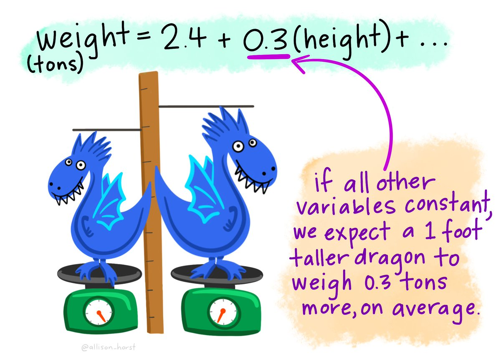
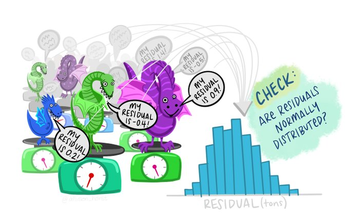
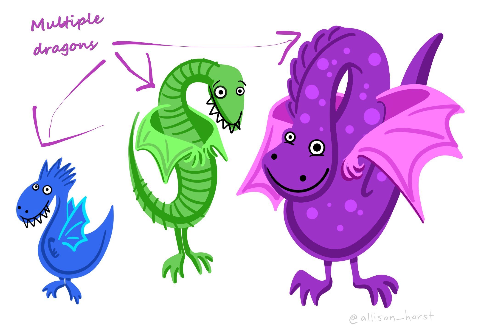
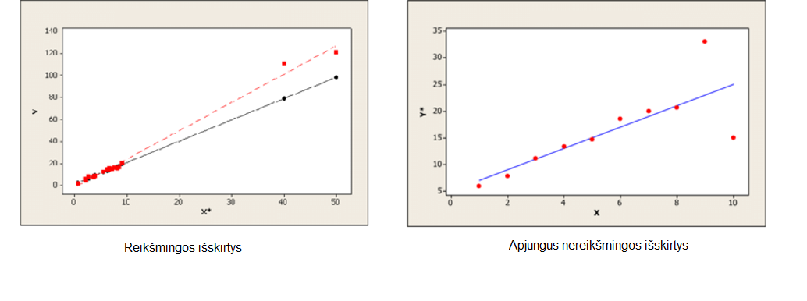
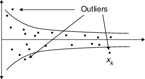
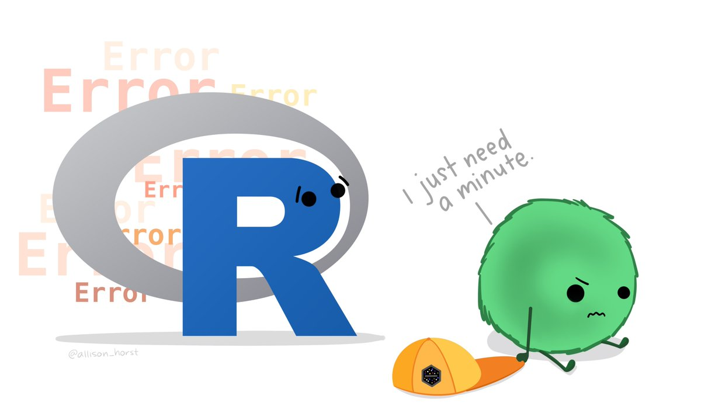

```{r setup, include=FALSE}


r = getOption("repos")
r["CRAN"] = "http://cran.us.r-project.org"
options(repos = r)


install.packages("rmarkdown")
install.packages("sortable")
install.packages("openxlsx")
install.packages("scales")
install.packages("readxl")
install.packages("tidyverse")
install.packages("remotes")
install.packages("fdm2id")
install.packages("plyr")
install.packages("SeleMix")
remotes::install_github("rstudio/gradethis")
remotes::install_github("rstudio/learnr")


library(learnr)
library(gradethis)
library(rmarkdown)
library(sortable)
library(openxlsx)
library(scales)
library(readxl)
library(tidyverse) 
library(fdm2id)
library(plyr)
library(SeleMix)
knitr::opts_chunk$set(echo = FALSE)
tutorial_options(
  exercise.checker = gradethis::grade_learnr, 
  exercise.startover = TRUE
)

setwd("~/SwedenStuff/Lietuvos Statistika/LS - 3 skaidres/LS - 3 skaidres")
# Create objects use throughout tutorial:
# Read in data as `duomenys`
duomenys <- read_excel("Duomenys.xlsx")
names(duomenys) <- c("kodas9", "evrk2", "imtis", "viso", "val", "viso_prm_ket", "viso_pr_ket", "pvm", "DSK")
duomenys <- duomenys[!is.na(duomenys$viso) & !(is.na(duomenys$pvm)),]
kuko <- cooks.distance(lm(viso ~ val, data = duomenys))
labels_kuko <- 1:sum(!is.na(duomenys$viso) & !is.na(duomenys$val))
labels_kuko[which(kuko < 0.2)] <- NA

duomenys1 <- read.xlsx("Duomenys1.xlsx")
names(duomenys1) <- c("kodas9", "vs2", "imtis", "viso_m1", "viso_m2", "viso_m3", "viso","val", "viso_prm_ket", "viso_pr_ket", "pvm1", "pvm2", "pvm3", "pvm", "DSK")
```

## Įžanga

```{r, echo=FALSE, out.width="100%", fig.align = "center"}
  
```

```{r, echo=FALSE, out.width="10%", fig.align = "center"}
knitr::include_graphics("images/LS_logo.svg")  
```

<br>
Šioje platformoje rasite mokymų medžiagą Lietuvos Statistikos departamento viduje organizuojamiems mokymams, skirtiems tikslinėms darbuotojų grupėms. Vienas pagrindinių šių mokymų siekių – platinti Lietuvos Statistikos darbuotojų žinias ir gebėjimus atlikti statistinių duomenų tinkamumo patvirtinimą, redagavimą, praleistų reikšmių įrašymą naudojantis R programavimo kalba.  <br><br> Teorinė mokymų medžiaga jau yra parengta skaidrių pavidalu. Šioje platformoje turite galimybę mokytis savarankiškai – peržiūrėti parengtą mokymų medžiagą, atlikti praktines užduotis.
<br><br> Trečiojoje mokymų dalyje pateikiama naudinga informacija apie:

- **Pirsono koreliaciją**: ir kaip ją apskaičiuoti pašalinus išskirtis. <br>
- **Tiesinės regresijos modeliavimą**: kaip jį atlikti ir patikrinti statistinį reikšmingumą. <br>
- **Tiesinės regresijos modelio prielaidas**: bei Kuko matą. <br> 
- **Daugialypės regresijos modeliavimą**: kaip jį atlikti ir patikrinti statistinį reikšmingumą. <br>
- **Pasirinktinio redagavimo metodą**: ir kaip jį apskaičiuoti naudojantis R. <br>
- **Hidiroglou-Berthelot metodą**: ir kaip jį apskaičiuoti naudojantis R.
<br><br>

#### Kaip tai veikia?

Rasite klausimų su atsakymų variantais:
```{r quiz0, warning=FALSE, echo=FALSE}
quiz(caption = "",
  question("Kiek bus 5+5?", 
           answer("15"),
           answer("10", correct = TRUE), 
           answer("11"),
           answer("100"),
           correct = "Atsakymas teisingas!", 
           incorrect = "Atsakymas neteisingas",
  submit_button = "Pateikti", 
  try_again_button = "Iš naujo",
    allow_retry = TRUE
  )
)
```

Rasite klausimų, kuriuose reikalinga išrikiuoti atsakymus pagal tam tikrą eilę:

```{r ranking-example, warning=FALSE, echo=FALSE}

question_rank("<br>1. 2+2 <br>
              2. 10+10 <br>
              3. 100-90 <br>
              4. 4*2",
  answer(skales <- c(
    "4",
    "20",
    "10",
    "8"),
  correct = TRUE), correct = "Teisingai!", incorrect = "Bandykite dar kartą!",
  allow_retry = TRUE,
  random_answer_order = TRUE,
  submit_button = "Pateikti",
  options = sortable_options(), 
  try_again_button = "Iš naujo"
)
```


Taip pat, dirbsite su R, kur programavimo kodas veiks lyg dirbant tiesiogiai programoje. Paspauskite `Ctr+Enter` arba `Vykdyti kodą` mygtuką, kad įvykdytumėte programą. 

```{r, echo=FALSE, out.width="85%", fig.align = "center"}
knitr::include_graphics("images/code_chunk_key.png")  
```

```{r example1, exercise=TRUE, exercise.lines = 4, exercise.cap = "R kodas"}
2+2
```

Jeigu nerandate tinkamo atsakymo kodo langelyje, galite pasinaudoti `Užuomina` , arba pasitikrinti atsakymą `Atsakymas` mygtuku. <br><br> Nepamirškite pateikti atsakymo paspausdami `Pateikti atsakymą` mygtuką,  kur gausite išsamesnį komentarą apie savo kodą anglų kalba. 

```{r, echo=FALSE, out.width="85%", fig.align = "center"}
knitr::include_graphics("images/code_exercise_key.png")  
```

```{r example2, exercise=TRUE, exercise.lines = 3, exercise.cap = "R kodas"}
2+2==5
```

```{r example2-hint}
Ar suma teisinga?
```

```{r example2-solution}
2+2==4
```

```{r example2-check}
gradethis::grade_code()
```

Taip pat, prieš pradedant mokymus, svarbu nuspausti mygtuką `Perkrauti` (kaip pažymėta paveikslėlyje). Tai užtikrina, kad užduotys yra vykdomos nuo pradžių. Šį mygtuką galite naudoti kaskart, kai norite perkrauti mokymų medžiagą ir ją įvykdyti iš naujo.  

```{r, echo=FALSE, out.width="100%", fig.align = "center"}
knitr::include_graphics("images/start_over.png")  
```

#### Iliustracijos
Ši mokymų platforma iliustruota paveikslėliais, kuriuos galite rasti [šiuo adresu](https://github.com/allisonhorst/stats-illustrations/). Naudojant šias iliustracijas, cituokite jas taip: “Artwork by @allison_horst”.

**Sėkmės!**

## 1. Pirsono koreliacijos koeficientas
 
```{r, echo=FALSE, out.width="50%", fig.align = "center"}
knitr::include_graphics("images/krill_correlation.png")  
```


Pirsono koreliacijos koeficientas geriausiai įvertina tiesinę kintamųjų priklausomybę, kai yra patenkinta prielaida apie tų kintamųjų normalumą, tačiau praktikoje jis skaičiuojamas ir tada, kai kintamieji nėra pasiskirstę normaliai. 

Į sistemą tebėra importuota duomenų lentelė pavadinimu `duomenys` iš praėjusiojo mokymų bloko. <br>

**Kintamieji:**

- `kodas9`: įmonės kodas
- `evrk2`: įmonės ekonominės veiklos rūšies kodas
- `imtis`: patekimo į imtį indikatorius
- `viso`: bendra ataskaitinio laikotarpio įmonės apyvarta
- `val`:  visos ataskaitinį laikotarpį dirbtos įmonės darbuotojų valandos
- `viso_prm_ket`: bendra praeitų metų atitinkamo laikotarpio įmonės apyvarta
- `viso_pr_ket`: bendra praeito laikotarpio įmonės apyvarta
- `pvm`: įmonės apyvarta pagal PVM ataskaitų duomenis
- `DSK`: vidutinis ataskaitinio laikotarpio įmonės darbuotojų skaičius


#### 1.1. Apskaičiuokite Pirsono ("Pearson") koreliacijos koeficientą tarp `duomenys$pvm` ir `duomenys$viso` naudodamiesi `cor()` funkcija.
```{r Pearson-correlation, exercise=TRUE, exercise.cap = "R kodas", warning=FALSE, echo=FALSE}
cor(___$___, ___$___, method = "___", use = "pairwise.complete.obs")
```

```{r Pearson-correlation-hint}
Nepamirškite po kintamųjų įvesti metodą, t.y. method = "pearson".
```

```{r Pearson-correlation-solution}
cor(duomenys$pvm, duomenys$viso, method = "pearson", use = "pairwise.complete.obs")
```

```{r Pearson-correlation-check}
grade_this({
  if (identical(.result, cor(duomenys$pvm, duomenys$viso, method = "pearson", use = "pairwise.complete.obs"))) {
    pass("Puiku!")
  }
  if (!identical(.result, cor(duomenys$pvm, duomenys$viso, method = "pearson", use = "pairwise.complete.obs"))) {
    fail("Tikėjomės kito varianto! Pabandykite darkart.")
  }
})
```

#### 1.2. Įvykdykite žemiau nurodytus veiksmus

**1.** Pašalinkite išskirtis `pvm` ir `viso` stulpeliuose su žemiau nurodytu kodu (realioje situacijoje tokias išskirtis reikėtų pažymėti tikrinimui) **(1 ir 2 kodo eilutės)**.<br>**2.** Vizualiai patikrinkite, ar tebėra išsiskiriančių reikšmių. **(3 kodo eilutė)**
```{r redagavimas, exercise=TRUE, exercise.cap = "R kodas", warning=FALSE, echo=FALSE}
duomenys <- duomenys[-c(which.max(duomenys$___)),]
duomenys <- duomenys[-c(which.max(duomenys$___)),]
plot(duomenys[,c("___","___")], ylab = "Statistinio tyrimo apyvarta", xlab = "PVM apyvarta")
```

```{r redagavimas-solution}
duomenys <- duomenys[-c(which.max(duomenys$pvm)),]
duomenys <- duomenys[-c(which.max(duomenys$viso)),]
plot(duomenys[,c("pvm","viso")], ylab = "Statistinio tyrimo apyvarta", xlab = "PVM apyvarta")
```

```{r redagavimas-check}
gradethis::grade_code()
```


**3.** Apskaičiuokite Pirsono koreliacijos koeficientą tarp `pvm` ir `viso` dar kartą. **(4 kodo eilutė)**
```{r redagavimas2-setup}
duomenys <- duomenys[-c(which.max(duomenys$pvm)),]
duomenys <- duomenys[-c(which.max(duomenys$viso)),]
plot(duomenys[,c("pvm","viso")], ylab = "Statistinio tyrimo apyvarta", xlab = "PVM apyvarta")
```

```{r redagavimas2, exercise=TRUE, exercise.cap = "R kodas", warning=FALSE, echo=FALSE}

cor(___$___, ___$___, method = "___", use = "pairwise.complete.obs")


```

```{r redagavimas2-solution}
cor(duomenys$pvm, duomenys$viso, method = "pearson", use = "pairwise.complete.obs")
```

```{r redagavimas2-check}
grade_this({
  if (identical(.result, cor(duomenys$pvm, duomenys$viso, method = "pearson", use = "pairwise.complete.obs"))) {
    pass("Puiku!")
  }
  if (!identical(.result, cor(duomenys$pvm, duomenys$viso, method = "pearson", use = "pairwise.complete.obs"))) {
    fail("Tikėjomės kito varianto! Pabandykite darkart.")
  }
})
```

#### 1.3. Koks buvo *1.2.* Pirsono koreliacijos koeficientas po išskirčių pašalinimo?
```{r quiz1, warning=FALSE, echo=FALSE}
quiz(caption = "",
  question("", 
           answer("0.47"),
           answer("0.94", correct = TRUE), 
           correct = "Atsakymas teisingas! Pašalinus išskirtis `pvm` ir `viso` stulpeliuose koreliacija tapo dvigubai stipresnė.", 
           incorrect = "Bandykite dar kartą.",
           allow_retry = TRUE,
  submit_button = "Pateikti", 
  try_again_button = "Iš naujo"
  )
)
```

Jei turime mažai stebinių arba turime ranginius kintamuosius, siūloma taikyti Spirmeno (Spearman) koreliacijos koeficiento įvertį $r_{s}(x,y)$.<br> Spirmano koreliacijos koeficientas skaičiuojamas pakeičiant `method` funkciją iš `pearson` į `spearman`.


<br><br>
Tiesa, nepamirškime, kad pasitaiko ir [klaidingų koreliacijų](https://www.tylervigen.com/chart-pngs/2.png): 

```{r, echo=FALSE, out.width="80%", fig.align = "center"}
knitr::include_graphics("images/spurrious_correlation.png")  
```

## 2. Tiesinės regresijos modelis

```{r, echo=FALSE, out.width="50%", fig.align = "center"}
  
```

Koreliacinė analizė parodo, ar dviejų kintamųjų reikšmės yra susijusios ir koks tos sąsajos stiprumas. Jei šito užtenka, šioje vietoje analizę ir baigiame. Jei norime geriau suprasti šią sąsają, galime atlikti regresinę analizę. Regresijos modelis – statistinis modelis, leidžiantis vieno kintamojo reikšmes prognozuoti pagal kito kintamojo reikšmes. Tiesinės regresijos modelis yra: $$𝑌_𝑖=𝑎+𝑏𝑥_𝑖+𝑒_𝑖$$

#### 2.1. Sudarykite tiesinės regresijos modelį `viso` bei `pvm` kintamiesiems naudodamiesi `lm()` funkcija.
```{r regresija, exercise=TRUE, exercise.cap = "R kodas", warning=FALSE, echo=FALSE}
Modelis <- __(viso ~ pvm, data = duomenys)
summary(___)
```

```{r regresija-hint}
Nepamirškite naudotis 'summary()' funkcija, kad patikrintumėte 'Modelis' rezultatą.
```


```{r regresija-solution}
Modelis <- lm(viso ~ pvm, data = duomenys)
summary(Modelis)
```

```{r regresija-check}
grade_result(
  pass_if(~ identical(.result, summary(Modelis))),
  fail_if(~ TRUE)
)
```

Kaip vienas iš regresijos modelio tinkamumo rodiklių - plačiai naudojamas determinacijos koeficientas $r^2$. Paprastosios tiesinės regresijos atveju jis sutampa su Pirsono koreliacijos koeficientu, pakeltu kvadratu. Praktiškai taikant regresinę analizę, dažniausiai reikalaujama, kad $𝑟^2$≥0,25.


#### 2.2. Ar, nepašalinus išskirčių, determinacijos koeficientas $r^2$ *2.1.* modelyje yra didesnis nei arba lygus 0.25?

```{r quiz2, echo=FALSE, warning=FALSE}
quiz(caption = "",
  question("", 
           answer("Taip"), 
           answer("Ne", correct = TRUE),
           correct = "Atsakymas teisingas!", 
           incorrect = "Bandykite dar kartą.",
           allow_retry = TRUE,
  submit_button = "Pateikti", 
  try_again_button = "Iš naujo"
  )
)
```

## 3. Tiesinės regresijos modelio prielaidos 

```{r, echo=FALSE, out.width="70%", fig.align = "center"}
  
```

#### 3.1. Pažymėkite 4 pagrindines tiesinės regresijos modelio prielaidas.
```{r quiz3, warning =FALSE, echo=FALSE}
question_checkbox(
"",
answer("Paklaidų normalumas", correct = TRUE),
answer("Paklaidų vidurkių lygybė nuliui", correct = TRUE),
answer("Paklaidų nepriklausomumas", correct = TRUE),
answer("Paklaidų dispersijų lygybė", correct = TRUE),
answer("Reikšmių normalumas"),
answer("Santykinė paklaida lygi nuliui"),
answer("Santykių sumos vienodos"),
answer("Santykių sumos skirtingos"),
    random_answer_order = TRUE,
    allow_retry = TRUE,
    try_again = "Bandykite iš naujo",
    submit_button = "Pateikti",
    try_again_button = "Iš naujo",
    correct = "Atsakymas teisingas!", 
    incorrect = "Bandykite dar kartą."
)
```

#### 3.2. Dar kartą sudarykite tiesinės regresijos modelį `viso` bei `val` kintamiesiems ir apskaičiuokite Kuko matą naudodamiesi funcija `cookplot()`.

**Kuko matas** parodo ar duomenyse yra išskirčių. Kai Kuko matas $>1$, atitinkantis stebinys - išskirtis. 
``` {r cooks-distance, exercise = TRUE, exercise.cap = "R kodas", warning = FALSE, echo = FALSE}

cookplot(lm(___ ~ ___, data = duomenys), labels = labels_kuko)
```

```{r cooks-distance-hint}
Dažniausiai išskirtimi laikomas stebinys, kurio Kuko reikšmė didesnė nei 1.
```

```{r cooks-distance-solution}

cookplot(lm(viso ~ val, data = duomenys), labels = labels_kuko)
```

```{r cooks-distance-check}
gradethis::grade_code()
```

```{r quiz4, warning =FALSE, echo=FALSE}
question_checkbox(
"Pagal Kuko mato taisyklę, pasirinkite visus išsiskiriančių reikšmių identifikacinius numerius.",
answer("218", correct = TRUE),
answer("401", correct = TRUE),
answer("677", correct = TRUE),
answer("1264", correct = TRUE),
answer("1675", correct = TRUE),
answer("3949", correct = TRUE),
answer("219"),
answer("1060"),
answer("1400"),
answer("2270"),
    random_answer_order = TRUE,
    allow_retry = TRUE,
    try_again = "Bandykite iš naujo",
    submit_button = "Pateikti",
    try_again_button = "Iš naujo",
    correct = "Atsakymas teisingas!", 
    incorrect = "Bandykite dar kartą."
)
```

#### 3.3. Kuo rėmėtės spręsdami apie *3.2.* pažymėtas išsiskiriančias reikšmes?

```{r quiz5, echo=FALSE, warning=FALSE}
quiz(caption = "",
  question("", 
           answer("$D_i>1$", correct = TRUE), 
           answer("$|SR_i |>2$ arba $|SR_i |>3.4$"),
           answer("$h_i>4/n$"),
           answer("$r^2≥0.25$"),
           correct = "Atsakymas teisingas!", 
           incorrect = "Bandykite dar kartą.",
           allow_retry = TRUE,
  submit_button = "Pateikti",
  try_again_button = "Iš naujo"
  )
)
```

## 4. Daugialypės regresijos modelis 

```{r, echo=FALSE, out.width="50%", fig.align = "center"}
  
```

Tiesinės daugialypės regresijos modelis yra tiesinės regresijos modelio apibendrinimas, kai nepriklausomų intervalinių kintamųjų yra daugiau nei vienas.

#### 4.1. Sudarykite daugialypės regresijos modelį prognozuodami `viso` reikšmę pagal `pvm` ir `val`  reikšmes.
```{r daugialype-regresija, exercise=TRUE, exercise.cap = "R kodas", warning=FALSE, echo=FALSE}
DaugialypisModelis <- lm(___ ~ ___ + ___, data = duomenys)

```

```{r daugialype-regresija-hint}
Nepamirškite naudotis 'summary()' funkcija, kad patikrintumėte 'DaugialypisModelis' rezultatą.
```


```{r daugialype-regresija-solution}
DaugialypisModelis <- lm(viso ~ pvm + val, data = duomenys)
summary(DaugialypisModelis)
```

```{r daugialype-regresija-check}
gradethis::grade_code()
```

```{r quiz6, echo=FALSE, warning=FALSE}
quiz(caption = "",
  question("Ar *4.1.* modelyje pasiektas $p$ reikšmingumo lygmuo `pvm` ir `val` kintamiesiems $p<0.05$?", 
           answer("Taip", correct = TRUE), 
           answer("Ne"),
           correct = "Atsakymas teisingas!", 
           incorrect = "Bandykite dar kartą.",
           allow_retry = TRUE,
  submit_button = "Pateikti",
  try_again_button = "Iš naujo"
  )
)
```

## 5. Pasirinktinio redagavimo metodas

Pasirinktinis redagavimas (angl. [Selective Editing](https://www.istat.it/en/files/2013/12/jos-2013-0039.pdf)) yra paremtas idėja ieškoti tik reikšmingų klaidų duomenyse, taip sutaupant laiko ir žmogiškųjų išteklių bei išlaikant siektiną įverčių tikslumą. Metodui taikyti naudojama statistinio paketo R biblioteka „SeleMix“.<br><br>

```{r, echo=FALSE, out.width="70%", fig.align = "center"}
  
```

Naudokite kitą duomenų lentelę pavadinimu `duomenys1`, jau importuota į sistemą.<br><br>

**Kintamieji:**

- `kodas9`: įmonės kodas
- `vs2`: grupės kodas
- `imtis`: patekimo į imtį indikatorius
- `viso_m1`: ataskaitinio laikotarpio įmonės apyvarta pirmą mėnesį
- `viso_m2`: ataskaitinio laikotarpio įmonės apyvarta antrą mėnesį
- `viso_m3`: ataskaitinio laikotarpio įmonės apyvarta trečią mėnesį
- `viso`:  visos ataskaitinį laikotarpį dirbtos įmonės darbuotojų valandos
- `val`: valandų skaičius
- `viso_prm_ket`: bendra praeitų metų atitinkamo laikotarpio įmonės apyvarta
- `viso_pr_ket`: bendra praeito laikotarpio įmonės apyvarta
- `pvm1`: ataskaitinio laikotarpio įmonės pvm pirmą mėnesį
- `pvm2`: ataskaitinio laikotarpio įmonės pvm antrą mėnesį
- `pvm3`: ataskaitinio laikotarpio įmonės pvm trečią mėnesį
- `pvm`: įmonės apyvarta pagal PVM ataskaitų duomenis
- `DSK`: vidutinis ataskaitinio laikotarpio įmonės darbuotojų skaičius
 <br>

#### 5.1. Patikrinkite, ar `duomenys1` atitinka aukščiau nurodytus kintamųjų pavadinimus su funkcija names(). 
```{r duomenys1, exercise=TRUE, exercise.cap = "R kodas", warning=FALSE, echo=FALSE}
duomenys1
```

```{r duomenys1-solution}
names(duomenys1)
```


```{r duomenys1-check}
gradethis::grade_code()
```

<br>

Pasirinktinio redagavimo metodu ieškosime reikšmingų klaidų `viso` apyvartos duomenyse.

#### 5.2. Atidžiai peržiūrėkite pasirinktinio redagavimo kodą. Sekite, kur paliktos tuščios vietos, jas užpildykite <br> (_Kodo vykdymas gali užtrukti porą minučių_).

```{r selective-editing1, exercise=TRUE, exercise.cap = "R kodas", exercise.timelimit = 30000, warning=FALSE, echo=FALSE}
duom <- duomenys1[complete.cases(duomenys1$___) & complete.cases(duomenys1$pvm),]# `pvm` bei `viso` kintamiesiems atrinkite įrašus be praleistų reikšmių; išsaugokite naujus duomenis pavadinimu `duom`

duom <- duom[duom$pvm > 0 & duom$___ > 0,]# `pvm` bei `viso` kintamiesiems atrinkite įrašus didesnius už 0 (**2 eilutė**); išsaugokite naujus duomenis pavadinimu `duom` 


# Suraskite kiekvienos veiklos įmonių skaičių
nrow_f <- function(df) length(df$viso)
nrow_df <- ddply(duom, .(vs2), nrow_f)
duom <- merge(duom, nrow_df, by = "vs2")
names(duom)

# Matematinis metodas bus taikomas veiklų grupėms, kuriose yra bent 5 įmonės; 
nepateke1 <- duom[duom$V1 < 5,] # Nepatekusios įmonės išsaugomos atskirai pavadinimu `nepateke1`
nepateke1 <- nepateke1[,c(2,1,3:ncol(nepateke1))]
duom <- duom[duom$V1 >= 5,] # Patekusios įmonės toliau išsaugomos `duom`

names(nepateke1)[ncol(nepateke1)] <- "________" # Pabrauktose vietose, pervadinkite paskutinį stulpelį į "grupes_dydis"
names(duom)[ncol(duom)] <- "_________" # Pabrauktose vietose, pervadinkite paskutinį stulpelį į "grupes_dydis"


#-----KIEKVIENOS VEIKLOS T.SEL PARAMETRAS-----

library("dplyr")
library("SeleMix")

band <- function(duom) {
  # Didžiausio tikėtinumo metodu įvertinami užterštų duomenų modelio parametrai ir 
  # pateikiami modelio tinkamumo rodikliai:
  est1 <- ml.est(y = duom$viso, x = duom$pvm, eps = 0.1)
  const <- 0
  for (i in seq(from = 0, to = 1, by = 0.001)) {
    SEi <- i # tikslumo lygmuo
    # Skaičiuojamos score funkcijų reikšmės ir išskiriamos galimai reikšmingos klaidos:
    sel1 <- as.data.frame(sel.edit(y = duom$viso, ypred = est1$ypred, t.sel = SEi))
    SelEdit <- sel1$sel
    SE <- sum(SelEdit) # galimai reikšmingų klaidų skaičius
    proc <- round(SE/length(duom$viso)*100, digits = 2) # galimai reikšmingų klaidų procentinė dalis
    const <- rbind(const, data.frame(SEi, SE, proc)) # klaidų sk. kiekvienam tikslumo lygmeniui
  }
  rib <- filter(const, const$SE > 1)
  t.sel <- max(rib$SEi) # išrenkamas didžiausias tikslumo lygmuo, su kuriuo dar randama reikšmingų klaidų
  ribos <- data.frame(duom$vs2, t.sel) # didžiausias tikslumo lygmuo kiekvienai veiklai
}
ribos2 <- do.call(rbind, by(duom, duom$vs2, band))
t_sel_pvm <- data.frame(veikla = ribos2$duom.vs2, t.sel = ifelse(ribos2$t.sel == 0, 0.001, ribos2$t.sel))
t_sel_pvm <- data.frame(unique(t_sel_pvm))


#-----SKAIČIAVIMAI-----

DUOM <- 0
est1 <- 0
sel1 <- 0
issk <- 0
issk2 <- 0

for(i in 1:nrow(t_sel_pvm)) {
  DUOM[i] = list(subset(duom, duom$vs2 == t_sel_pvm$veikla[i]))
  est1[i] = ml.est(y = DUOM[[i]][,"viso"], x = DUOM[[i]][,"pvm"], eps = 0.1)
  sel1[i] = list(sel.edit(y = DUOM[[i]][,"viso"], ypred = est1[[i]][,1], t.sel = t_sel_pvm[,"t.sel"][i])[,9])
  issk[i] = list(data.frame(DUOM[[i]], t_sel_pvm$t.sel[i], sel_editing1 = sel1[[i]]))
}

isskirtys_pvm <- do.call(rbind.data.frame, issk)
isskirtys_pvm$skirt_pm = round((1-(isskirtys_pvm$pvm/isskirtys_pvm$viso))*100, 1)
```

```{r selective-editing1-hint}

duom <- duomenys1[complete.cases(duomenys1$pvm) & complete.cases(duomenys1$viso),]
duom <- duom[duom$pvm > 0 & duom$viso > 0,]

nrow_f <- function(df) length(df$viso)
nrow_df <- ddply(duom, .(vs2), nrow_f)
duom <- merge(duom, nrow_df, by = "vs2")
names(duom)


nepateke1 <- duom[duom$V1 < 5,]
nepateke1 <- nepateke1[,c(2,1,3:ncol(nepateke1))]
names(nepateke1)[ncol(nepateke1)] <- "Grupes_dydis"

duom <- duom[duom$V1 >= 5,]
names(duom)[ncol(duom)] <- "Grupes_dydis"

#-----KIEKVIENOS VEIKLOS T.SEL PARAMETRAS-----

library("dplyr")

band <- function(duom) {
  # Didžiausio tikėtinumo metodu įvertinami užterštų duomenų modelio parametrai ir 
  # pateikiami modelio tinkamumo rodikliai:
  est1 <- ml.est(y = duom$viso, x = duom$pvm, eps = 0.1)
  const <- 0
  for (i in seq(from = 0, to = 1, by = 0.001)) {
    SEi <- i # tikslumo lygmuo
    # Skaičiuojamos score funkcijų reikšmės ir išskiriamos galimai reikšmingos klaidos:
    sel1 <- as.data.frame(sel.edit(y = duom$viso, ypred = est1$ypred, t.sel = SEi))
    SelEdit <- sel1$sel
    SE <- sum(SelEdit) # galimai reikšmingų klaidų skaičius
    proc <- round(SE/length(duom$viso)*100, digits = 2) # galimai reikšmingų klaidų procentinė dalis
    const <- rbind(const, data.frame(SEi, SE, proc)) # klaidų sk. kiekvienam tikslumo lygmeniui
  }
  rib <- filter(const, const$SE > 1)
  t.sel <- max(rib$SEi) # išrenkamas didžiausias tikslumo lygmuo, su kuriuo dar randama reikšmingų klaidų
  ribos <- data.frame(duom$vs2, t.sel) # didžiausias tikslumo lygmuo kiekvienai veiklai
}
ribos2 <- do.call(rbind, by(duom, duom$vs2, band))
t_sel_pvm <- data.frame(veikla = ribos2$duom.vs2, t.sel = ifelse(ribos2$t.sel == 0, 0.001, ribos2$t.sel))
t_sel_pvm <- data.frame(unique(t_sel_pvm))


#-----SKAIČIAVIMAI-----

DUOM <- 0
est1 <- 0
sel1 <- 0
issk <- 0
issk2 <- 0

for(i in 1:nrow(t_sel_pvm)) {
  DUOM[i] = list(subset(duom, duom$vs2 == t_sel_pvm$veikla[i]))
  est1[i] = ml.est(y = DUOM[[i]][,"viso"], x = DUOM[[i]][,"pvm"], eps = 0.1)
  sel1[i] = list(sel.edit(y = DUOM[[i]][,"viso"], ypred = est1[[i]][,1], t.sel = t_sel_pvm[,"t.sel"][i])[,9])
  issk[i] = list(data.frame(DUOM[[i]], t_sel_pvm$t.sel[i], sel_editing1 = sel1[[i]]))
}

isskirtys_pvm <- do.call(rbind.data.frame, issk)
isskirtys_pvm$skirt_pm = round((1-(isskirtys_pvm$pvm/isskirtys_pvm$viso))*100, 1)

```

```{r selective-editing1-solution}

duom <- duomenys1[complete.cases(duomenys1$pvm) & complete.cases(duomenys1$viso),]
duom <- duom[duom$pvm > 0 & duom$viso > 0,]

nrow_f <- function(df) length(df$viso)
nrow_df <- ddply(duom, .(vs2), nrow_f)
duom <- merge(duom, nrow_df, by = "vs2")
names(duom)


nepateke1 <- duom[duom$V1 < 5,]
nepateke1 <- nepateke1[,c(2,1,3:ncol(nepateke1))]
names(nepateke1)[ncol(nepateke1)] <- "Grupes_dydis"

duom <- duom[duom$V1 >= 5,]
names(duom)[ncol(duom)] <- "Grupes_dydis"

#-----KIEKVIENOS VEIKLOS T.SEL PARAMETRAS-----

library("dplyr")

band <- function(duom) {
  # Didžiausio tikėtinumo metodu įvertinami užterštų duomenų modelio parametrai ir 
  # pateikiami modelio tinkamumo rodikliai:
  est1 <- ml.est(y = duom$viso, x = duom$pvm, eps = 0.1)
  const <- 0
  for (i in seq(from = 0, to = 1, by = 0.001)) {
    SEi <- i # tikslumo lygmuo
    # Skaičiuojamos score funkcijų reikšmės ir išskiriamos galimai reikšmingos klaidos:
    sel1 <- as.data.frame(sel.edit(y = duom$viso, ypred = est1$ypred, t.sel = SEi))
    SelEdit <- sel1$sel
    SE <- sum(SelEdit) # galimai reikšmingų klaidų skaičius
    proc <- round(SE/length(duom$viso)*100, digits = 2) # galimai reikšmingų klaidų procentinė dalis
    const <- rbind(const, data.frame(SEi, SE, proc)) # klaidų sk. kiekvienam tikslumo lygmeniui
  }
  rib <- filter(const, const$SE > 1)
  t.sel <- max(rib$SEi) # išrenkamas didžiausias tikslumo lygmuo, su kuriuo dar randama reikšmingų klaidų
  ribos <- data.frame(duom$vs2, t.sel) # didžiausias tikslumo lygmuo kiekvienai veiklai
}
ribos2 <- do.call(rbind, by(duom, duom$vs2, band))
t_sel_pvm <- data.frame(veikla = ribos2$duom.vs2, t.sel = ifelse(ribos2$t.sel == 0, 0.001, ribos2$t.sel))
t_sel_pvm <- data.frame(unique(t_sel_pvm))


#-----SKAIČIAVIMAI-----

DUOM <- 0
est1 <- 0
sel1 <- 0
issk <- 0
issk2 <- 0

for(i in 1:nrow(t_sel_pvm)) {
  DUOM[i] = list(subset(duom, duom$vs2 == t_sel_pvm$veikla[i]))
  est1[i] = ml.est(y = DUOM[[i]][,"viso"], x = DUOM[[i]][,"pvm"], eps = 0.1)
  sel1[i] = list(sel.edit(y = DUOM[[i]][,"viso"], ypred = est1[[i]][,1], t.sel = t_sel_pvm[,"t.sel"][i])[,9])
  issk[i] = list(data.frame(DUOM[[i]], t_sel_pvm$t.sel[i], sel_editing1 = sel1[[i]]))
}

isskirtys_pvm <- do.call(rbind.data.frame, issk)
isskirtys_pvm$skirt_pm = round((1-(isskirtys_pvm$pvm/isskirtys_pvm$viso))*100, 1)

```

#### 5.3. Pasinaudokite žemiau esančiu kodo langeliu, kad apskaičiuotumėte kiek išskirčių buvo nustatyta pasirinktinio redagavimo metodu. 

```{r selective-editing2, exercise=TRUE, exercise.lines = 3, exercise.cap = "R kodas", exercise.setup = "selective-editing1-solution", exercise.timelimit = 30000}
___(isskirtys_pvm$sel_editing1)
```

```{r selective-editing2-hint}
Galite pasinaudoti funkcija count().
```

```{r selective-editing2-solution}
count(isskirtys_pvm$sel_editing1)
```

```{r quiz7, echo=FALSE, warning=FALSE}
quiz(caption = "",
  question("Kiek išskirčių nustatyta naudojantis pasirinktinio redagavimo metodu?", 
           answer("197"), 
           answer("3635"),
           answer("179", correct = TRUE),
           answer("3536"),
           correct = "Atsakymas teisingas! Naudojantis pasirinktinio redagavimo metodu, nustatyta 179 išskirtys", 
           incorrect = "Bandykite dar kartą. Išskirtys, aukščiau pateikoje lentelėje, užkoduotos 1. ",
           allow_retry = TRUE,
  submit_button = "Pateikti",
  try_again_button = "Iš naujo"
  )
)
```

```{r, echo=FALSE, out.width="50%", fig.align = "center"}
  
```

## 6. *Hidiroglou-Berthelot* metodas 
<br>

```{r, echo=FALSE, out.width="30%", fig.align = "left"}
  
```

<br>[Hidiroglou-Berthelot metodas](https://ssc.ca/sites/default/files/survey/documents/SSC2003_R_Belcher.pdf) buvo pasiūlytas M.A.Hidiroglou ir J. M. Bertheloto (1986) periodiniams verslo statistiniams tyrimams.

Žemiau pateikiamas kodas *Hidiroglou-Berthelot* metodui, taikytinas įmonių apyvartos išskirtims nustatyti. Skaičiuosime išskirtis `viso` kintamajam. 


#### 6.1. Atidžiai peržiūrėkite kodą. Sekite, kur paliktos tuščios vietos, jas užpildykite.


```{r HB, exercise=TRUE, exercise.cap = "R kodas",exercise.timelimit = 30000, warning=FALSE, echo=FALSE}

# Pirmiausia, atrenkami įrašai be praleistų reikšmių ir didesni už 0
duom <- duomenys1[complete.cases(duomenys1$viso_prm_ket) & complete.cases(duomenys1$viso),]
duom <- duom[duom$viso_prm_ket > 0 & duom$viso > 0,]

# Surandamas kiekvienos veiklos įmonių skaičius pagal jų veiklos sritį
nrow_f <- function(df) length(df$viso)
nrow_df <- ddply(duom, .(vs2), nrow_f)
duom <- merge(duom, nrow_df, by = "vs2")


# Pagal straipsnyje pateikiamas rekomendacijas, veiklų grupės, kuriose yra mažiau nei 3 įmonės - pašalinamos, kitos - įrašomos kaip `duom`.
nepateke2 <- duom[duom$V1 < 3,]
duom <- duom[duom$V1 >= 3,]

# Pabrauktose vietose, pervadinkite paskutinį stulpelį į "grupes_dydis"
names(nepateke2)[ncol(nepateke2)] <- "______"
names(duom)[ncol(duom)] <- "______"


#----------------KIEKVIENOS VEIKLOS C PARAMETRAS--------------------------------
# Žemiau pateikta funkcija apibrėžia Hidiroglou-Berthelot metodą mūsų turimiems duomenims. 

HidBer <- function(duom) {
  const1 <- 0
  ataskaitinis <- duom$viso # ataskaitiniai duomenys
  ankstesnis <- duom$viso_prm_ket # istoriniai duomenys
  u <- ___ # apibrėžkite 'u' konstantą 0.4
  A <- ___ # apibrėžkite 'A' konstantą kaip apraašyta mokymų skaidrėse (Hidiroglou-Berthelot metodas (IV)
  for (i in 1:500) {
    R <- ataskaitinis/ankstesnis # Kiekvienam stebimam populiacijos elementui 𝑖 apibrėžiame individualų santykinį pokytį
    m <- median(R) # Tegu $𝑅_𝑀$ – santykinių pokyčių $𝑅_𝑖$ mediana
    S <- ifelse(R > 0 & R < m, (1-(m/R)), ifelse(R >= m, ((R/m)-1), 0)) # Taikoma $𝑅_𝑖4 transformacija
    E <- S*(max(ataskaitinis, ankstesnis)^u)
    Em <- median(E)
    Eq1 <- quantile(E, prob = 0.25, type = 2)
    Eq3 <- quantile(E, prob = 0.75, type = 2)
    Dq1 <- max(Em-Eq1, abs(A*Em))
    Dq3 <- max(Eq3-Em, abs(A*Em))
    C <- i
    ap_r <- Em-C*Dq1
    virs_r <- Em+C*Dq3
    H_B1 <- data.frame(HB = ifelse(E < ap_r | E > virs_r, 1, 0))
    HB <- sum(H_B1$HB) # išskirčių skaičius
    proc <- round(HB/length(ankstesnis)*100, digits = 2) # išskirčių procentinė dalis
    const1 = rbind(const1, data.frame(C, HB, proc)) # išskirčių skaičius skirtingiems C
  }
  # rib1 <- filter(const1, const1$proc < 10 & const1$proc > 5) # išskirčių proc. dalis tarp 5 ir 10
  rib1 <- const1[const1$proc < 10 & const1$proc > 5,] # išskirčių proc. dalis tarp 5 ir 10
  c <- max(rib1$C) # išrenkamas didžiausias C, su kuriuo dar randama reikšmingų klaidų
  ribos_hb <- data.frame(duom$vs2, c) # didžiausias C kiekvienai veiklai
}

ribos_HB <- do.call(rbind, by(duom, duom$vs2, HidBer))
# c_aut <- filter(ribos_HB, ribos_HB$c > 0)
c_aut <- ribos_HB[ribos_HB$c > 0,] # c mediana - pasisalini kurios lygios nuliui
aut <- median(c_aut$c)
C <- data.frame(veikla = ribos_HB$duom.vs2, C = ifelse(ribos_HB$c == '-Inf', aut, ribos_HB$c))
C <- data.frame(unique(C))


#-----SKAIČIAVIMAI-----

DUOM2 <- 0
ataskaitinis <- 0
ankstesnis <- 0
R <- 0
m <- 0
S <- 0
E <- 0
Em <- 0
Eq1 <- 0
Eq3 <- 0
Dq1 <- 0
Dq3 <- 0
C_p <- 0
ap_r <- 0
virs_r <- 0
H_B1 <- 0
u <- 0.4
A <- 0.05

for (i in 1:nrow(C)) {
  DUOM2[i] = list(subset(duom, duom$vs2 == C$veikla[i]))
  ataskaitinis[i] <- list(DUOM2[[i]][,"viso"])
  ankstesnis[i] <- list(DUOM2[[i]][,"viso_prm_ket"])
  R[i] <- list(ataskaitinis[[i]]/ankstesnis[[i]])
  m[i] <- list(median(R[[i]]))
  S[i] <- list(ifelse(R[[i]] > 0 & R[[i]] < m[[i]], (1-(m[[i]]/R[[i]])),
                      ifelse(R[[i]] >= m[[i]], ((R[[i]]/m[[i]])-1), 0)))
  E[i] <- list(S[[i]]*(max(ataskaitinis[[i]], ankstesnis[[i]])^u))
  Em[i] <- list(median(E[[i]]))
  Eq1[i] <- list(quantile(E[[i]], prob = 0.25, type = 2))
  Eq3[i] <- list(quantile(E[[i]], prob = 0.75, type = 2))
  Dq1[i] <- list(max(Em[[i]]-Eq1[[i]], abs(A*Em[[i]])))
  Dq3[i] <- list(max(Eq3[[i]]-Em[[i]], abs(A*Em[[i]])))
  C_p[i] <- C[,"C"][i]
  ap_r[i] <- list(Em[[i]]-C_p[[i]]*Dq1[[i]])
  virs_r[i] <- list(Em[[i]]+C_p[[i]]*Dq3[[i]])
  H_B1[i] <- list(data.frame(DUOM2[[i]], C = C_p[[i]], HB = ifelse(E[[i]] < ap_r[[i]] | E[[i]] > virs_r[[i]], 1, 0)))
}

isskirtys_HB1 <- do.call(rbind.data.frame, H_B1)
isskirtys_HB1$skirt_HB1 = round((1-(isskirtys_HB1$viso_prm_ket/isskirtys_HB1$viso))*100, 1)


count(isskirtys_HB1$HB)
```

```{r HB-hint-1}
Nepamirškite įrašyti visas praleistas reikšmes, įskaitant u = 0.4, A = 0.05 (kaip nurodyta mokymų skaidrėse).
```

```{r HB-hint-2}


# Atrenkami įrašai be praleistų reikšmių ir didesni už 0
duom <- duomenys1[complete.cases(duomenys1$viso_prm_ket) & complete.cases(duomenys1$viso),]
duom <- duom[duom$viso_prm_ket > 0 & duom$viso > 0,]

# Surandamas kiekvienos veiklos įmonių skaičius
#pagal veikla
nrow_f <- function(df) length(df$viso)
nrow_df <- ddply(duom, .(vs2), nrow_f)
duom <- merge(duom, nrow_df, by = "vs2")


# Matematinis metodas bus taikomas veiklų grupėms, kuriose yra bent 3 įmonės
nepateke2 <- duom[duom$V1 < 3,]
nepateke2 <- nepateke2[,c(2,1,3:ncol(nepateke2))]
names(nepateke2)[ncol(nepateke2)] <- "Grupes_dydis"

duom <- duom[duom$V1 >= 3,]
names(duom)[ncol(duom)] <- "Grupes_dydis"


#-----KIEKVIENOS VEIKLOS C PARAMETRAS-----

HidBer <- function(duom) {
  const1 <- 0
  ataskaitinis <- duom$viso
  ankstesnis <- duom$viso_prm_ket # istoriniai duomenys
  u <- 0.4 # kostantos 
  A <- 0.05
  for (i in 1:500) {
    R <- ataskaitinis/ankstesnis
    m <- median(R)
    S <- ifelse(R > 0 & R < m, (1-(m/R)), ifelse(R >= m, ((R/m)-1), 0))
    E <- S*(max(ataskaitinis, ankstesnis)^u)
    Em <- median(E)
    Eq1 <- quantile(E, prob = 0.25, type = 2)
    Eq3 <- quantile(E, prob = 0.75, type = 2)
    Dq1 <- max(Em-Eq1, abs(A*Em))
    Dq3 <- max(Eq3-Em, abs(A*Em))
    C <- i
    ap_r <- Em-C*Dq1
    virs_r <- Em+C*Dq3
    H_B1 <- data.frame(HB = ifelse(E < ap_r | E > virs_r, 1, 0))
    HB <- sum(H_B1$HB) # išskirčių skaičius
    proc <- round(HB/length(ankstesnis)*100, digits = 2) # išskirčių procentinė dalis
    const1 = rbind(const1, data.frame(C, HB, proc)) # išskirčių skaičius skirtingiems C
  }
  # rib1 <- filter(const1, const1$proc < 10 & const1$proc > 5) # išskirčių proc. dalis tarp 5 ir 10
  rib1 <- const1[const1$proc < 10 & const1$proc > 5,] # išskirčių proc. dalis tarp 5 ir 10
  c <- max(rib1$C) # išrenkamas didžiausias C, su kuriuo dar randama reikšmingų klaidų
  ribos_hb <- data.frame(duom$vs2, c) # didžiausias C kiekvienai veiklai
}

ribos_HB <- do.call(rbind, by(duom, duom$vs2, HidBer))
# c_aut <- filter(ribos_HB, ribos_HB$c > 0)
c_aut <- ribos_HB[ribos_HB$c > 0,] # c mediana - pasisalini kurios lygios nuliui
aut <- median(c_aut$c)
C <- data.frame(veikla = ribos_HB$duom.vs2, C = ifelse(ribos_HB$c == '-Inf', aut, ribos_HB$c))
C <- data.frame(unique(C))


#-----SKAIČIAVIMAI-----

DUOM2 <- 0
ataskaitinis <- 0
ankstesnis <- 0
R <- 0
m <- 0
S <- 0
E <- 0
Em <- 0
Eq1 <- 0
Eq3 <- 0
Dq1 <- 0
Dq3 <- 0
C_p <- 0
ap_r <- 0
virs_r <- 0
H_B1 <- 0
u <- 0.4
A <- 0.05

for (i in 1:nrow(C)) {
  DUOM2[i] = list(subset(duom, duom$vs2 == C$veikla[i]))
  ataskaitinis[i] <- list(DUOM2[[i]][,"viso"])
  ankstesnis[i] <- list(DUOM2[[i]][,"viso_prm_ket"])
  R[i] <- list(ataskaitinis[[i]]/ankstesnis[[i]])
  m[i] <- list(median(R[[i]]))
  S[i] <- list(ifelse(R[[i]] > 0 & R[[i]] < m[[i]], (1-(m[[i]]/R[[i]])),
                      ifelse(R[[i]] >= m[[i]], ((R[[i]]/m[[i]])-1), 0)))
  E[i] <- list(S[[i]]*(max(ataskaitinis[[i]], ankstesnis[[i]])^u))
  Em[i] <- list(median(E[[i]]))
  Eq1[i] <- list(quantile(E[[i]], prob = 0.25, type = 2))
  Eq3[i] <- list(quantile(E[[i]], prob = 0.75, type = 2))
  Dq1[i] <- list(max(Em[[i]]-Eq1[[i]], abs(A*Em[[i]])))
  Dq3[i] <- list(max(Eq3[[i]]-Em[[i]], abs(A*Em[[i]])))
  C_p[i] <- C[,"C"][i]
  ap_r[i] <- list(Em[[i]]-C_p[[i]]*Dq1[[i]])
  virs_r[i] <- list(Em[[i]]+C_p[[i]]*Dq3[[i]])
  H_B1[i] <- list(data.frame(DUOM2[[i]], C = C_p[[i]], HB = ifelse(E[[i]] < ap_r[[i]] | E[[i]] > virs_r[[i]], 1, 0)))
}

isskirtys_HB1 <- do.call(rbind.data.frame, H_B1)
isskirtys_HB1$skirt_HB1 = round((1-(isskirtys_HB1$viso_prm_ket/isskirtys_HB1$viso))*100, 1)
```

```{r HB-solution}


# Atrenkami įrašai be praleistų reikšmių ir didesni už 0
duom <- duomenys1[complete.cases(duomenys1$viso_prm_ket) & complete.cases(duomenys1$viso),]
duom <- duom[duom$viso_prm_ket > 0 & duom$viso > 0,]

# Surandamas kiekvienos veiklos įmonių skaičius
#pagal veikla
nrow_f <- function(df) length(df$viso)
nrow_df <- ddply(duom, .(vs2), nrow_f)
duom <- merge(duom, nrow_df, by = "vs2")


# Matematinis metodas bus taikomas veiklų grupėms, kuriose yra bent 3 įmonės
nepateke2 <- duom[duom$V1 < 3,]
nepateke2 <- nepateke2[,c(2,1,3:ncol(nepateke2))]
names(nepateke2)[ncol(nepateke2)] <- "Grupes_dydis"

duom <- duom[duom$V1 >= 3,]
names(duom)[ncol(duom)] <- "Grupes_dydis"


#-----KIEKVIENOS VEIKLOS C PARAMETRAS-----

HidBer <- function(duom) {
  const1 <- 0
  ataskaitinis <- duom$viso
  ankstesnis <- duom$viso_prm_ket # istoriniai duomenys
  u <- 0.4 # kostantos 
  A <- 0.05
  for (i in 1:500) {
    R <- ataskaitinis/ankstesnis
    m <- median(R)
    S <- ifelse(R > 0 & R < m, (1-(m/R)), ifelse(R >= m, ((R/m)-1), 0))
    E <- S*(max(ataskaitinis, ankstesnis)^u)
    Em <- median(E)
    Eq1 <- quantile(E, prob = 0.25, type = 2)
    Eq3 <- quantile(E, prob = 0.75, type = 2)
    Dq1 <- max(Em-Eq1, abs(A*Em))
    Dq3 <- max(Eq3-Em, abs(A*Em))
    C <- i
    ap_r <- Em-C*Dq1
    virs_r <- Em+C*Dq3
    H_B1 <- data.frame(HB = ifelse(E < ap_r | E > virs_r, 1, 0))
    HB <- sum(H_B1$HB) # išskirčių skaičius
    proc <- round(HB/length(ankstesnis)*100, digits = 2) # išskirčių procentinė dalis
    const1 = rbind(const1, data.frame(C, HB, proc)) # išskirčių skaičius skirtingiems C
  }
  # rib1 <- filter(const1, const1$proc < 10 & const1$proc > 5) # išskirčių proc. dalis tarp 5 ir 10
  rib1 <- const1[const1$proc < 10 & const1$proc > 5,] # išskirčių proc. dalis tarp 5 ir 10
  c <- max(rib1$C) # išrenkamas didžiausias C, su kuriuo dar randama reikšmingų klaidų
  ribos_hb <- data.frame(duom$vs2, c) # didžiausias C kiekvienai veiklai
}

ribos_HB <- do.call(rbind, by(duom, duom$vs2, HidBer))
# c_aut <- filter(ribos_HB, ribos_HB$c > 0)
c_aut <- ribos_HB[ribos_HB$c > 0,] # c mediana - pasisalini kurios lygios nuliui
aut <- median(c_aut$c)
C <- data.frame(veikla = ribos_HB$duom.vs2, C = ifelse(ribos_HB$c == '-Inf', aut, ribos_HB$c))
C <- data.frame(unique(C))


#-----SKAIČIAVIMAI-----

DUOM2 <- 0
ataskaitinis <- 0
ankstesnis <- 0
R <- 0
m <- 0
S <- 0
E <- 0
Em <- 0
Eq1 <- 0
Eq3 <- 0
Dq1 <- 0
Dq3 <- 0
C_p <- 0
ap_r <- 0
virs_r <- 0
H_B1 <- 0
u <- 0.4
A <- 0.05

for (i in 1:nrow(C)) {
  DUOM2[i] = list(subset(duom, duom$vs2 == C$veikla[i]))
  ataskaitinis[i] <- list(DUOM2[[i]][,"viso"])
  ankstesnis[i] <- list(DUOM2[[i]][,"viso_prm_ket"])
  R[i] <- list(ataskaitinis[[i]]/ankstesnis[[i]])
  m[i] <- list(median(R[[i]]))
  S[i] <- list(ifelse(R[[i]] > 0 & R[[i]] < m[[i]], (1-(m[[i]]/R[[i]])),
                      ifelse(R[[i]] >= m[[i]], ((R[[i]]/m[[i]])-1), 0)))
  E[i] <- list(S[[i]]*(max(ataskaitinis[[i]], ankstesnis[[i]])^u))
  Em[i] <- list(median(E[[i]]))
  Eq1[i] <- list(quantile(E[[i]], prob = 0.25, type = 2))
  Eq3[i] <- list(quantile(E[[i]], prob = 0.75, type = 2))
  Dq1[i] <- list(max(Em[[i]]-Eq1[[i]], abs(A*Em[[i]])))
  Dq3[i] <- list(max(Eq3[[i]]-Em[[i]], abs(A*Em[[i]])))
  C_p[i] <- C[,"C"][i]
  ap_r[i] <- list(Em[[i]]-C_p[[i]]*Dq1[[i]])
  virs_r[i] <- list(Em[[i]]+C_p[[i]]*Dq3[[i]])
  H_B1[i] <- list(data.frame(DUOM2[[i]], C = C_p[[i]], HB = ifelse(E[[i]] < ap_r[[i]] | E[[i]] > virs_r[[i]], 1, 0)))
}

isskirtys_HB1 <- do.call(rbind.data.frame, H_B1)
isskirtys_HB1$skirt_HB1 = round((1-(isskirtys_HB1$viso_prm_ket/isskirtys_HB1$viso))*100, 1)
```


#### 6.2. Pasinaudokite žemiau esančiu kodo langeliu, kad apskaičiuotumėte kiek išskirčių buvo nustatyta Hidiroglou-Berthelot metodu. 

```{r HB2, exercise=TRUE, exercise.lines = 3, exercise.cap = "R kodas", exercise.setup = "HB-solution", exercise.timelimit = 30000}
___(isskirtys_HB1$HB)
```

```{r HB2-hint}
Galite pasinaudoti funkcija count().
```

```{r HB2-solution}
count(isskirtys_HB1$HB)
```

```{r quiz8, echo=FALSE, warning=FALSE}
quiz(caption = "",
  question("Kiek išskirčių nustatyta?", 
           answer("168", correct = TRUE), 
           answer("2536"),
           answer("167"),
           answer("2356"),
           correct = "Atsakymas teisingas! Naudojantis Hidiroglou-Berthelot metodu, nustatyta 168 išskirtys", 
           incorrect = "Bandykite dar kartą. Išskirtys, aukščiau pateikoje lentelėje, užkoduotos 0. ",
           allow_retry = TRUE,
  submit_button = "Pateikti",
  try_again_button = "Iš naujo"
  )
)
```

#### 6.3. Tyrimo tikslas - nustatyti, kaip paaugo įmonių apyvarta per pastarąjį ketvirtį. Kaip papildomus duomenis, turime praėjusių metų to paties ketvirčio apyvartos duomenis. 

```{r quiz9, warning=FALSE, echo=FALSE}
question_checkbox(
"Kokį išskirčių nustatymo būdą naudosite aprašytam atvejui?",
answer("*Hidiroglou-Berthelot* metodą", correct = TRUE),
answer("Pasirinktinio redagavimo metodą"),
answer("Lokalaus tikslo funkciją"),
answer("Liekamąją santykinę paklaidą"),
    random_answer_order = TRUE,
    allow_retry = TRUE,
    try_again = "Bandykite iš naujo. Turėkite omenyje, kad esama istorinių duomenų, kurie gali būti naudojami viename iš šių metodų. Pasikartokite teorines žinias mokymų skaidrėse.",
    submit_button = "Pateikti",
    try_again_button = "Iš naujo",
    correct = "Atsakymas teisingas! Kadangi esama istorinių įmonės duomenų apie PVM, renkamės *Hidiroglou-Berthelot* metodą.", 
    incorrect = "Bandykite dar kartą."
)
```

```{r, echo=FALSE, out.width="50%", fig.align = "center"}
  
```

```{r, echo=FALSE, out.width="10%", fig.align = "right"}
knitr::include_graphics("images/learnr.png")  
```