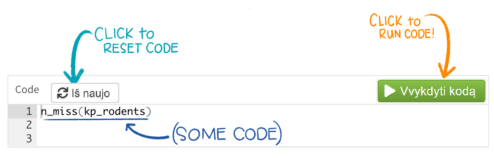
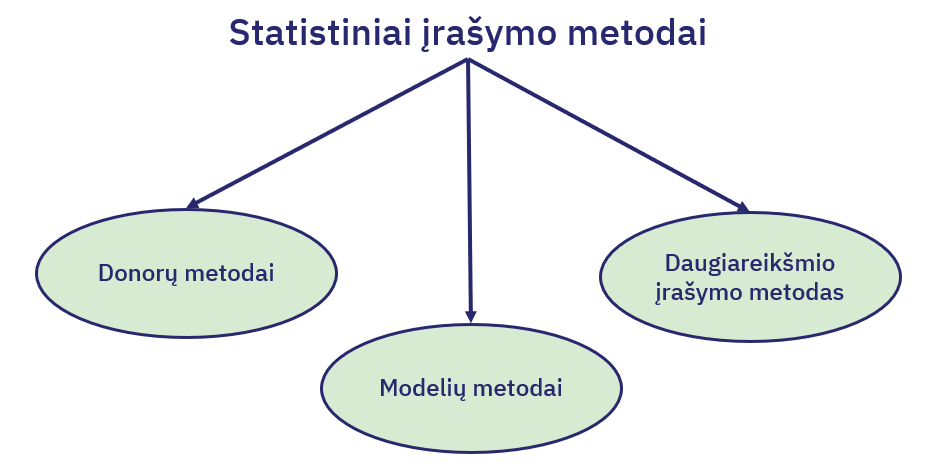
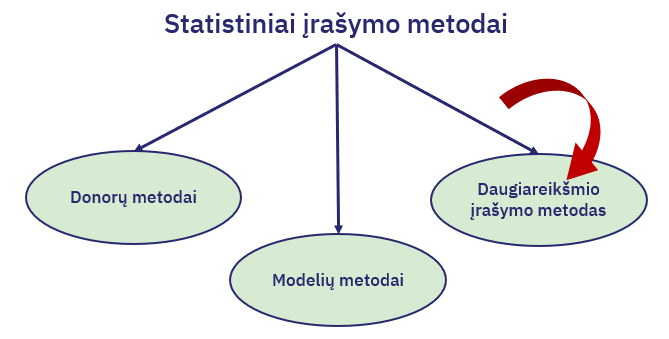

```{r setup, include=FALSE}

r = getOption("repos")
r["CRAN"] = "http://cran.us.r-project.org"
options(repos = r)

# 
# install.packages("rmarkdown")
# install.packages("sortable")
# install.packages("openxlsx")
# install.packages("scales")
# install.packages("readxl")
# install.packages("tidyverse")
# install.packages("remotes")
# install.packages("fdm2id")
# install.packages("plyr")
# install.packages("SeleMix")
# install.packages("vcd")
# install.packages("VIM")
# install.packages("dplyr")
# remotes::install_github("rstudio/gradethis")
# remotes::install_github("rstudio/learnr")


library(learnr)
library(gradethis)
library(rmarkdown)
library(sortable)
library(openxlsx)
library(scales)
library(readxl)
library(tidyverse) 
library(fdm2id)
library(plyr)
library(SeleMix)
library(mice)
library(vcd)
library(VIM)
library(dplyr)
knitr::opts_chunk$set(echo = FALSE)
tutorial_options(
  exercise.checker = gradethis::grade_learnr, 
  exercise.startover = TRUE
)
setwd("~/SwedenStuff/Lietuvos Statistika/LS - 4 skaidres")
# Create objects use throughout tutorial:
# Read in data as `duomenys`

rm(list = ls())

options(scipen = 999)
set.seed(10)

duomenys <- readRDS("Duomenys_irasymui.RData")
duomenys <- subset(duomenys, AMZIUS == 32:38)
ISSL <- unique(duomenys[!is.na(duomenys$ISSILAVINIMAS_KODAS),
                        c("ISSILAVINIMAS_KODAS","ISSILAVINIMAS_PAVADINIMAS")])

duomenys$ISSILAVINIMAS_KODAS_f <- as.factor(duomenys$ISSILAVINIMAS_KODAS)
duomenys$ISSILAVINIMAS_KODAS_imp <- as.factor(duomenys$ISSILAVINIMAS_KODAS)
```

## Įžanga
```{r, echo=FALSE, out.width="80%", fig.align = "center"}
knitr::include_graphics("images/important.jfif")  
```

```{r, echo=FALSE, out.width="10%", fig.align = "center"}
knitr::include_graphics("images/LS_logo.svg")  
```

<br>
Šioje platformoje rasite mokymų medžiagą Lietuvos Statistikos departamento viduje organizuojamiems mokymams, skirtiems tikslinėms darbuotojų grupėms. Vienas pagrindinių šių mokymų siekių – platinti Lietuvos Statistikos darbuotojų žinias ir gebėjimus atlikti statistinių duomenų tinkamumo patvirtinimą, redagavimą, praleistų reikšmių įrašymą naudojantis R programavimo kalba.  <br><br> Teorinė mokymų medžiaga jau yra parengta skaidrių pavidalu. Šioje platformoje turite galimybę mokytis savarankiškai – peržiūrėti parengtą mokymų medžiagą, atlikti praktines užduotis.
<br><br> Ketvirtojoje mokymų dalyje pateikiama naudinga informacija apie:

- **Loginį įrašymo metodą**<br>
- **Statistinį įrašymo metodą**, kuris skirstomas į: <br>
  - **Donorų įrašymo metodus**: istorinis, atsitiktinis, nuoseklus, hierarchinis ir artimiausio kaimyno įrašymas
  - **Modelių įrašymo metodus**: vidurkio, santykio ir regresinis įrašymas
  - **Daugiareikšmio įrašymo metodus**
- **Įrašymo kokybės tikrinimą**
- **Įrašymo metodo testavimą**
<br>

#### Kaip tai veikia?

Rasite klausimų su atsakymų variantais:
```{r quiz0, warning=FALSE, echo=FALSE}
quiz(caption = "",
  question("Kiek bus 5+5?", 
           answer("15"),
           answer("10", correct = TRUE), 
           answer("11"),
           answer("100"),
           correct = "Atsakymas teisingas!", 
           incorrect = "Atsakymas neteisingas",
  submit_button = "Pateikti", 
  try_again_button = "Iš naujo",
    allow_retry = TRUE
  )
)
```

Rasite klausimų, kuriuose reikalinga išrikiuoti atsakymus pagal tam tikrą eilę:

```{r ranking-example, warning=FALSE, echo=FALSE}

question_rank("<br>1. 2+2 <br>
              2. 10+10 <br>
              3. 100-90 <br>
              4. 4*2",
  answer(skales <- c(
    "4",
    "20",
    "10",
    "8"),
  correct = TRUE), correct = "Teisingai!", incorrect = "Bandykite dar kartą!",
  allow_retry = TRUE,
  random_answer_order = TRUE,
  submit_button = "Pateikti",
  options = sortable_options(), 
  try_again_button = "Iš naujo"
)
```

Taip pat, dirbsite su R, kur programavimo kodas veiks lyg dirbant tiesiogiai programoje. Paspauskite `Ctr+Enter` arba `Vykdyti kodą` mygtuką, kad įvykdytumėte programą. 

```{r, echo=FALSE, out.width="85%", fig.align = "center"}
  
```

```{r example1, exercise=TRUE, exercise.lines = 4, exercise.cap = "R kodas"}
2+2
```

Jeigu nerandate tinkamo atsakymo kodo langelyje, galite pasinaudoti `Užuomina` , arba pasitikrinti atsakymą `Atsakymas` mygtuku. <br><br> Nepamirškite pateikti atsakymo paspausdami `Pateikti atsakymą` mygtuką, kur gausite išsamesnį komentarą apie savo kodą anglų kalba. 

```{r, echo=FALSE, out.width="85%", fig.align = "center"}
knitr::include_graphics("images/code_exercise_key.png")  
```

```{r example2, exercise=TRUE, exercise.lines = 3, exercise.cap = "R kodas"}
2+2==5
```

```{r example2-hint}
Ar suma teisinga?
```

```{r example2-solution}
2+2==4
```

```{r example2-check}
gradethis::grade_code()
```

Taip pat, prieš pradedant mokymus, svarbu nuspausti mygtuką `Perkrauti` (kaip pažymėta paveikslėlyje). Tai užtikrina, kad užduotys yra vykdomos nuo pradžių. Šį mygtuką galite naudoti kaskart, kai norite perkrauti mokymų medžiagą ir ją įvykdyti iš naujo. 

```{r, echo=FALSE, out.width="100%", fig.align = "center"}
knitr::include_graphics("images/start_over.png")  
```

#### Iliustracijos
Ši mokymų platforma iliustruota paveikslėliais, kuriuos galite rasti [šiuo adresu](https://github.com/allisonhorst/stats-illustrations/). Naudojant šias iliustracijas, cituokite jas taip: “Artwork by @allison_horst”.

**Sėkmės!**

## 1. Loginis įrašymo metodas

```{r, echo=FALSE, out.width="70%", fig.align = "center"}
knitr::include_graphics("images/imputation.png")  
```

Loginis įrašymo metodas pasižymi tuo, kad vietoj praleistų ar klaidingų reikšmių įrašomos tikslios reikšmės, panaudojant respondento pateiktus statistinius duomenis. Loginis įrašymas turi būti atliekamas prieš taikant visus kitus įrašymo metodus.

#### 1.1. Pažymėkite 3 loginio įrašymo privalumus. 

```{r quiz1, warning =FALSE, echo=FALSE}
question_checkbox(
"",
answer("Patikimas, nes trūkstama reikšmė nustatoma vienareikšmiškai.", correct = TRUE),
answer("Įrašytos reikšmės automatiškai tenkina visas statistinių duomenų redagavimo taisykles.", correct = TRUE),
answer("Pats paprasčiausias statistinių duomenų įrašymo metodas.", correct = TRUE),
answer("Taikytinas net kai nėra pateikti tenkinantys loginius ar aritmetinius sąryšius statistiniai duomenys."),
answer("Nereikia atlikti jokių skaičiavimų įrašomoms reikšmėms gauti."),
answer("Patogus, nes yra nedaug skaičiavimų."),
answer("Tinkamas ir kategoriniams statistiniams duomenims, kai surikiavus pagal kiekybinius kintamuosius įrašomos kokybinio kintamojo reikšmės."),
    random_answer_order = TRUE,
    allow_retry = TRUE,
    try_again = "Bandykite iš naujo",
    submit_button = "Pateikti",
    try_again_button = "Iš naujo",
    correct = "Atsakymas teisingas!", 
    incorrect = "Bandykite dar kartą."
)
```

## 2. Statistinis įrašymo metodas


*Statistinis įrašymo metodas* – toks metodas, kai reikšmėms įrašyti naudojami papildomi duomenys ir įvairūs statistiniai metodai.

```{r, echo=FALSE, out.width="80%", fig.align = "center"}
  
``` 

#### 2.1. Surikiuokite statistinio įrašymo metodus pagal žemiau pateiktą jų apibūdinimų eilę.

```{r ranking-imputation-methods, warning=FALSE, echo=FALSE}

question_rank("<br> 1. Įrašymo metodai, kai vietoj praleistos arba klaidingos kintamojo reikšmės įrašoma panašaus tiriamosios populiacijos elemento atitinkamo kintamojo reikšmė arba to paties elemento reikšmė iš ankstesnio tyrimo ar kitų šaltinių. <br>
              2. Įrašymo metodai, pagrįsti tyrimo kintamojo reikšmių statistiniais modeliais. <br>
              3. Įrašymo metodas, kai kiekvienai praleistai reikšmei, taikomas pasirinktas įrašymo metodas, modeliuojama keletas reikšmių.",
  answer(skales <- c(
    "Donorų metodas",
    "Modelių metodas",
    "Daugiareikšmio įrašymo metodas"),
  correct = TRUE), correct = "Teisingai!", incorrect = "Bandykite dar kartą!",
  allow_retry = TRUE,
  random_answer_order = TRUE,
  submit_button = "Pateikti",
  options = sortable_options(), 
  try_again_button = "Iš naujo"
)
```

## 3. Donorų metodas

```{r, echo=FALSE, out.width="80%", fig.align = "center"}
knitr::include_graphics("images/donoru.png")  
``` 

### Istorinių arba „šaltų“ duomenų įrašymo metodas

*Istorinių arba „šaltų“ duomenų įrašymas* [angl. cold deck imputation](https://www.researchgate.net/publication/322160882_Cold_Deck_Imputation_for_Survey_Non-response_Through_Record_Linkage) – metodas, kai vietoj praleistų ar klaidingų statistinio tyrimo kintamojo reikšmių įrašomi ankstesnių statistinių tyrimų ar kitų šaltinių duomenys. Šis įrašymo metodas naudojamas, kai nagrinėjamas kintamasis su ankstesniais duomenimis susijęs labiau, negu su nagrinėjamo statistinių duomenų rinkinio reikšmėmis

### Atsitiktinis „šiltų“ duomenų įrašymo metodas

*Atsitiktinis „šiltų“ duomenų įrašymas* [angl. random hot deck imputation](https://www.ncbi.nlm.nih.gov/pmc/articles/PMC3130338/). Remiantis pagalbiniais kategoriniais kintamaisiais, kurių reikšmės žinomos visiems populiacijos (imties) elementams, sudaromos įrašymo klasės su vienodomis šių kintamųjų reikšmėmis. Kiekvienam recipientui donoras parenkamas atsitiktinai, paprastai potencialių donorų išrinkimo tikimybės imamos vienodos.

- Metodas labai paprastas, tačiau tokiu būdu įrašyta reikšmė neturi sąryšio su tikrąja reikšme.

### Nuoseklus „šiltų“ duomenų įrašymo metodas

*Nuoseklus „šiltų“ duomenų įrašymas* *(angl. sequential hot deck imputation)* – metodas, kai, tam tikru būdu išrikiavus duomenų rinkinį, recipientui parenkamas tos pačios įrašymo klasės donoras, kuris duomenų rinkinyje eina prieš recipientą.

- **Metodo privalumai**: patogus, nes yra nedaug skaičiavimų. Tinkamas ir kategoriniams statistiniams duomenims, kai surikiavus pagal kiekybinius kintamuosius įrašomos kokybinio kintamojo reikšmės. 
- **Metodo trūkumas**: gali pasitaikyti daug tokių pačių įrašytų reikšmių. Taip gali atsitikti dėl mažo donorų skaičiaus įrašymo klasėje, taip pat tokiu atveju, jei duomenų rinkinyje vienas po kito eina keli elementai su praleista nagrinėjamo kintamojo reikšme. To galima išvengti. Pavyzdžiui, pataisius įrašymo algoritmą: parenkami keli potencialūs donorai, duomenų rinkinyje einantys prieš recipientą, o tada iš jų atsitiktinai parenkamas vienas, kurio nagrinėjamo kintamojo reikšmę naudosime įrašant duomenis.

### Hierarchinis „šiltų“ duomenų įrašymo metodas

*Hierarchinis „šiltų“ duomenų įrašymas* *(angl. hierarchical hot deck imputation)* – tai nuoseklaus „šiltų“ duomenų įrašymo metodo apibendrinimas, kai naudojama daug papildomų kintamųjų (tuo pačiu ir daug įrašymo klasių).

### Artimiausio kaimyno įrašymo metodas

Artimiausio kaimyno įrašymo medotas [angl. nearest-neighbour imputation](https://www.jstatsoft.org/article/view/v074i07) – metodas, kai naudojantis vienu ar keliais papildomais kintamaisiais ir naudojant kokią nors atstumo funkciją recipientui randamas donoras su artimiausiomis tų kintamųjų reikšmėmis. <br><br> Optimalus kaimynų skaičius yra 10-15. 

```{r, echo=FALSE, out.width="80%", fig.align = "center"}
knitr::include_graphics("images/nearest_neighbour.gif")  
``` 

#### 3.1. Surikiuokite žemiau pateiktų statistinio įrašymo metodų privalumus pagal žemiau pateiktą jų pavadinimų eilę.

```{r ranking-donoru-metodas, warning=FALSE, echo=FALSE}

question_rank("<br> 1. Nuoseklus „šiltų“ duomenų įrašymas <br>
              2. Artimiausio kaimyno įrašymas <br>
              3. Atsitiktinis „šiltų“ duomenų įrašymas <br>
              4. Istorinių arba „šaltų“ duomenų įrašymas",
  answer(skales <- c(
    "Patogus, nes yra nedaug skaičiavimų. Tinkamas ir kategoriniams statistiniams duomenims, kai surikiavus pagal kiekybinius kintamuosius įrašomos kokybinio kintamojo reikšmės.",
    "Atstumo funkcijų būna įvairių. Šias atstumo funkcijas galima sukonstruoti taip, kad būtų sunku panaudoti tą patį donorą daug kartų, ir taip išvengti statistinių duomenų supanašėjimo.",
    "Šio įrašymo metodo privalumas – jis labai paprastas, tačiau tokiu būdu įrašyta reikšmė neturi sąryšio su tikrąja reikšme.",
    "Patogu naudoti šį metodą, nes nereikia atlikti jokių skaičiavimų įrašomoms reikšmėms gauti, tačiau jis gali būti panaudotas tik tais atvejais, kai yra pateikti praėjusių statistinių tyrimų duomenys."),
  correct = TRUE), correct = "Teisingai!", incorrect = "Bandykite dar kartą!",
  allow_retry = TRUE,
  random_answer_order = TRUE,
  submit_button = "Pateikti",
  options = sortable_options(), 
  try_again_button = "Iš naujo"
)
```

#### 3.2. Atlikite artimiausio kaimyno įrašymą duomenų rinkinio `duomenys` kintamajam `ISSILAVINIMAS_KODAS` naudodami 3 skirtingus pagalbinius kintamuosius. Žemiau esančiame kode pakeiskite `k` artimiausių kaimynų skaičių iš `k=10` į `k=15`. <br>

```{r KNN, exercise=TRUE, exercise.cap = "R kodas", warning=FALSE, echo=FALSE, exercise.timelimit = 30000}
knn_imp <- kNN(duomenys, variable = "ISSILAVINIMAS_KODAS_imp", k = 10,
               dist_var = c("BENDRAS_bdu","AKTYVUMAS_ID","AMZIUS"))
```

```{r KNN-hint-1}
Pakeiskite k = 10 į k = 15.
```

```{r KNN-solution}
knn_imp <- kNN(duomenys, variable = "ISSILAVINIMAS_KODAS_imp", k = 15,
               dist_var = c("BENDRAS_bdu","AKTYVUMAS_ID","AMZIUS"))

```

```{r KNN-check}
gradethis::grade_code()
```

#### 3.3. Pasinaudokite žemiau esančiu kodo langeliu ir suraskite koks išsilavinimo kodas *3.2.* užduotyje artimiausio kaimyno įrašymo metodu buvo priskirtas asmeniui, kurio `ASMENS_ID_NR` yra `395566`? 

*Reikšmė įrašyta naujai sukurtame stulpelyje pavadinimu `ISSILAVINIMAS_KODAS_imp`*
```{r KNN-kodas, exercise=TRUE, exercise.cap = "R kodas", warning=FALSE, echo=FALSE, exercise.setup = "KNN", exercise.timelimit = 30000}

```

```{r KNN-kodas-hint}
Pasinaudokite filter() funkcija. Ieškokite stulpelio pavadinimu ISSILAVINIMAS_KODAS_imp 
```

```{r KNN-kodas-solution}
knn_imp %>%
  filter(ASMENS_ID_NR == 395566)
```

```{r KNNquiz, warning=FALSE, echo=FALSE}
quiz(caption = "",
  question("", 
           answer("22"),
           answer("6"), 
           answer("12", correct = TRUE),
           answer("8"),
           correct = "Atsakymas teisingas!", 
           incorrect = "Bandykite dar kartą. Galite naudotis šiuo kodu aukščiau esančiame R lange: knn_imp %>%
  filter(ASMENS_ID_NR == 395566)",
           allow_retry = TRUE,
  submit_button = "Pateikti", 
  try_again_button = "Iš naujo"
  )
)
```

Pradžioje asmens išsilavinimas, kurio `ASMENS_ID_NR == 395566`, nebuvo nurodytas. Taikant artimiausio kaimyno įrašymo metodą, jam buvo priskirtas išsilavinimo kodas (jį suradote *3.3* užduotyje).


#### 3.4. Kokia šio išsilavinimo kodo reikšmė? 
```{r issilavinimo-kodo-tikrinimas, exercise=TRUE, exercise.lines = 4, exercise.cap = "R kodas"}
ISSL # ISSL - jau įrašyta duomenų lentelė su unikaliais išsilavinimo kodais ir jų pavadinimais. 
```

```{r issilavinimo-kodo-tikrinimas-hint}
Pavyzdžiui, galite naudotis subset() funkcija, kurios pagalba norimas atsakymas bus išvestas kaip rezultatas.
```

```{r issilavinimo-kodo-tikrinimas-solution}
subset(ISSL, ISSILAVINIMAS_KODAS == 12)
```

```{r issilavinimo-kodo-reiksme, warning=FALSE, echo=FALSE}
quiz(caption = "",
  question("", 
           answer("Specialioji vidurinė mokykla (technikumas)"),
           answer("Nebaigta pradinė mokykla"), 
           answer("Pagrindinė mokykla, progimnazija", correct = TRUE),
           answer("Profesinio mokymo įstaiga po vidurinės mokyklos"),
           answer("Universitetas (bakalauro studijos)"),
           correct = "Atsakymas teisingas!", 
           incorrect = "Bandykite dar kartą.",
           allow_retry = TRUE,
  submit_button = "Pateikti", 
  try_again_button = "Iš naujo"
  )
)
```


## 4. Modelių metodas

```{r, echo=FALSE, out.width="80%", fig.align = "center"}
knitr::include_graphics("images/modeliu.png")  
``` 

### Vidurkio įrašymas
*Vidurkio įrašymas (angl. mean imputation)* – metodas, kai vietoj praleistų ar klaidingų tyrimo kintamojo reikšmių yra įrašomas šio kintamojo elementų vidurkis. 
Šis įrašymo metodas gali tikti, kai tyrimo kintamojo reikšmės yra simetriškai pasiskirsčiusios apie tiriamosios populiacijos vidurkio reikšmę.

- **Metodo privalumas**: jį lengva realizuoti.


#### 4.1. Atliksime **vidurkio įrašymo metodą** praleistoms `Solar.R` reikšmėms. Pirmiausia, importuokite pavyzdinį duomenų rinkinį `oro_kokybe` ir patikrinkite, ar visos `Solar.R` reikšmės yra užpildytos, t.y. nėra trūkstamų reikšmių. Žemiau pateikti 3 skirtingi tikrinimo variantai. 

```{r mean-imputation-1, exercise=TRUE, exercise.lines = 6, exercise.cap = "R kodas"}
oro_kokybe <- airquality
mean(complete.cases(oro_kokybe$____))
unique(oro_kokybe$____)
any(is.na(oro_kokybe$____))
```

```{r mean-imputation-1-hint}
Tuščioje vietoje įveskite kintamojo, kurio trūkstamas reikšmes norite patikrinti, pavadinimą.
```

```{r mean-imputation-1-solution}
oro_kokybe <- airquality
mean(complete.cases(oro_kokybe$Solar.R))
unique(oro_kokybe$Solar.R)
any(is.na(oro_kokybe$Solar.R))
```

```{r mean-imputation-1-check}
gradethis::grade_code()
```

Kadangi atsakymas `[1] 0.9542484`, 95.43% visų reikšmių yra įrašytos, tad dalies - trūksta. 

Beje, nors šiuo atveju to nedaysime, paprastai vidurkio įrašymą geriausia atlikti tam tikrų grupių viduje. Pavyzdžiui, jeigu įrašinėtume vidurkį įmonių tyrimo duomenims, įrašytume ekonominės veiklos rūšies grupėms (pvz., žemės ūkio įmonėms atskirai įrašytume atitinkamos grupės vidurkį).

#### 4.2. Į trūkstamą vietą įrašykite vidurkio funkciją `mean()` (*2 eilutė*). 5-toje eilutėje su funkcija `mean()` taip pat patikrinkite ar trūstamų reikšmių neliko. 6-oje eilutėje su funkcija `unique()` įvertinkite, ar visos reikšmės įrašytos. 7-toje - `any()` įvertinkite ar liko neįrašytų reikšmių. 

```{r mean-imputation-2-setup}
oro_kokybe <- airquality
```

```{r mean-imputation-2, exercise=TRUE, exercise.lines = 7, exercise.cap = "R kodas"}
mean_imputation <- oro_kokybe %>%
  mutate(Solar.R = ifelse(is.na(Solar.R), round(___(Solar.R, na.rm=T), digits = 0), Solar.R))


_____(complete.cases(mean_imputation$Solar.R))
___(mean_imputation$Solar.R)
___(is.na(oro_kokybe$Solar.R))
```

```{r mean-imputation-2-hint}
Tuščioje vietoje įveskite funkcijų minimų užduotyje pavadinimus, taip kaip 4.1. užduotyje.
```

```{r mean-imputation-2-solution}
mean_imputation <- oro_kokybe %>%
  mutate(Solar.R = ifelse(is.na(Solar.R), round(mean(Solar.R, na.rm=T), digits = 0), Solar.R))


mean(complete.cases(mean_imputation$Solar.R))
unique(mean_imputation$Solar.R)
any(is.na(oro_kokybe$Solar.R))
```

```{r mean-imputation-2-check}
gradethis::grade_code()
```


Kadangi atsakymas `[1] 1`, vadinasi 100% visų reikšmių yra įrašytos. Norint patikrinti įrašymo kokybę, galite atlikti tolimesnius veiksmus, pvz. tikrinti, ar skirstinys reikšmingai pakito po įrašymo. Kokybės tikrinimas bus aptartas šių mokymų 6-tame skyriuje. 


### Santykiu pagrįstas įrašymas

*Santykiu pagrįstas įrašymas (angl. ratio imputation)* – tai metodas, kai vietoj praleistos ar klaidingos tyrimo kintamojo reikšmės yra įrašoma reikšmė, gauta naudojant šio ir papildomo kintamojo reikšmių santykį.

### Regresinis įrašymas

*Regresinis įrašymas (angl. regression imputation)* – metodas, kai įrašymui naudojami regresiniai modeliai.
Tarkime, tyrimo kintamasis yra 𝑌 ir turime papildomus kintamuosius $(𝑋_1, …, 𝑋_𝑞 )$. Galima sudaryti tiesinės regresijos modelį:
$$𝑌=𝑎+𝑏_1 𝑋_1+…+𝑏_𝑞 𝑋_𝑞+𝑒, $$

Norint naudoti regresinį įrašymą, reikia turėti bent vieną papildomą kintamąjį (regresorių), kuris gerai modeliuotų kintamąjį su praleistomis reikšmėmis. 

#### 4.3. Surikiuokite modelių metodų trūkumus pagal žemiau pateiktą jų pavadinimų eilę.
```{r ranking-modeliu-metodas, warning=FALSE, echo=FALSE}

question_rank("<br>1. Vidurkio įrašymas <br>
              2. Regresinis įrašymas <br>
              3. Santykiu pagrįstas įrašymas",
  answer(skales <- c("Vietoj praleistų reikšmių įrašius atsakiusiųjų populiacijos (imties) elementų vidurkį, gaunama mažesnė populiacijos (imties) dispersija, negu vien tik atsakiusiųjų populiacijos (imties) elementų dispersija. Todėl tikėtina, kad gali būti pakeistas tyrimo kintamojo skirstinys.",
    "Šiam metodui pagrindinė kliūtis – rasti tinkamą modelį. Jei tiesinis modelis netinka, galima taikyti ir netiesinį.",
    "Šiam metodui reikalinga, kad koreliacija su papildomu kintamuoju, kurio visos reikšmės žinomos, būtų didelė. Jeigu neturėsime to paties tyrimo praeito laikotarpio duomenų arba gerai koreliuojančio kito papildomo kintamojo, šio įrašymo metodo naudoti negalėsime."), correct = TRUE), correct = "Teisingai!", incorrect = "Bandykite dar kartą!",
  allow_retry = TRUE,
  random_answer_order = TRUE,
  submit_button = "Pateikti",
  options = sortable_options(), 
  try_again_button = "Iš naujo"
)
```


## 5. Daugiareikšmio įrašymo metodas

```{r, echo=FALSE, out.width="80%", fig.align = "center"}
  
``` 

Daugiareikšmio įrašymo metodą galima aprašyti tokiu algoritmu:

1. Taikant pasirinktą atsitiktinio praleistų reikšmių modeliavimo metodą (pvz. stochastinį regresinį įrašymą), vietoj praleistų ir klaidingų tyrimo kintamojo reikšmių sumodeliuojamos ir įrašomos priskirtos reikšmės. Sumodeliavus trūkstamas reikšmes vieną kartą, gaunamas užpildytas statistinių duomenų rinkinys;
2. Procedūra pakartojama nepriklausomai 𝑀 kartų ir gaunama 𝑀 užpildytų statistinių duomenų rinkinių (pagal literatūrą, pakanka imti 𝑀=10 ar net mažiau);
3. Naudojant kiekvieną iš šių duomenų rinkinių, įprastiniu būdu apskaičiuojamas tiriamosios populiacijos nagrinėjamo parametro įvertis – gaunama 𝑀 skirtingų įverčių;
4. Galutinis daugiareikšmio įrašymo metodu gaunamas parametro įvertis – šių 𝑀 įverčių aritmetinis vidurkis.

- **Metodo privalumai** -  ypač naudingas sudėtingų tyrimų duomenų analizei.
- **Metodo trūkumai** - sulaukia kritikos, kai praleistoms reikšmėms modeliuoti yra taikoma keletas modelių, arba kai neatsakymai yra neatsitiktiniai.

#### 5.1. Įveskite praleistas ar klaidingas

`ISSILAVINIMAS_KODAS_imp` reikšmes naudodamiesi daugiareikšmio įrašymo metodu `mice.impute.polyreg()` funkcija. <br> *(kitus stulpelius galima peržiūrėti su rodyklėmis prie pavadinimų)*

```{r daugiareiksmis1-setup}
set.seed(999)
```


```{r daugiareiksmis1, exercise=TRUE, exercise.cap = "R kodas", warning=FALSE, echo=FALSE, exercise.timelimit = 30000}
polyreg_imp6 <- _____(y = duomenys$_____,
                                    ry = !is.na(duomenys$______),
                                    x = duomenys[,c("BENDRAS_bdu","AKTYVUMAS_ID","AMZIUS")],
                                    wy = is.na(duomenys$______))
duomenys$ISSILAVINIMAS_KODAS_imp[is.na(duomenys$ISSILAVINIMAS_KODAS_imp)] <- polyreg_imp6
```

```{r daugiareiksmis1-hint-1}
Ar įvedėte `mice.impute.polyreg()` funkciją ir kintamojo pavadinimą į tuščias vietas? Taip pat, jei neaiški funkcijos sintaksė, pasinaudokite help("mice.impute.polyreg").
```

```{r daugiareiksmis1-hint-2}
polyreg_imp6 <- mice.impute.polyreg(y = duomenys$ISSILAVINIMAS_KODAS_imp,
                                    ry = !is.na(duomenys$ISSILAVINIMAS_KODAS_imp),
                                    x = duomenys[,c("BENDRAS_bdu","AKTYVUMAS_ID","AMZIUS")],
                                    wy = is.na(duomenys$ISSILAVINIMAS_KODAS_imp))
duomenys$ISSILAVINIMAS_KODAS_imp[is.na(duomenys$ISSILAVINIMAS_KODAS_imp)] <- polyreg_imp6
```

```{r daugiareiksmis1-solution}
polyreg_imp6 <- mice.impute.polyreg(y = duomenys$ISSILAVINIMAS_KODAS_imp,
                                    ry = !is.na(duomenys$ISSILAVINIMAS_KODAS_imp),
                                    x = duomenys[,c("BENDRAS_bdu", "AKTYVUMAS_ID", "AMZIUS")],
                                    wy = is.na(duomenys$ISSILAVINIMAS_KODAS_imp))
duomenys$ISSILAVINIMAS_KODAS_imp[is.na(duomenys$ISSILAVINIMAS_KODAS_imp)] <- polyreg_imp6
```

```{r daugiareiksmis1-check}
gradethis::grade_code()
```

#### 5.2. Pasinaudokite žemiau esančiu kodo langeliu ir suraskite koks išsilavinimo kodas *5.1.* užduotyje daugiareikšmio įrašymo metodu buvo priskirtas asmeniui, kurio `ASMENS_ID_NR` yra `395566`? 
```{r daugiareiksmis2, exercise=TRUE, exercise.cap = "R kodas", warning=FALSE, echo=FALSE, exercise.timelimit = 30000, exercise.setup = "daugiareiksmis1-hint-2"}

```

```{r daugiareiksmis2-hint}
Pasinaudokite filter() funkcija. Ieškote stulpelio pavadinimu ISSILAVINIMAS_KODAS_imp
```

```{r daugiareiksmis2-solution}
duomenys %>%
  filter(ASMENS_ID_NR == 395566)
```

```{r daugiareiksmis2-quiz, warning=FALSE, echo=FALSE}
quiz(caption = "",
  question("", 
           answer("12"),
           answer("7"), 
           answer("6"),
           answer("3", correct = TRUE),
           correct = "Atsakymas teisingas!", 
           incorrect = "Bandykite dar kartą. Pasinaudokite užuomina aukščiau esančiame kodo lange.",
           allow_retry = TRUE,
  submit_button = "Pateikti", 
  try_again_button = "Iš naujo"
  )
)
```

Pradžioje, asmens išsilavinimas, kurio `ASMENS_ID_NR == 395566`, nebuvo nurodytas. Taikant daugiareikšmio įrašymo metodą, jam buvo priskirtas išsilavinimo kodas (jį suradote *5.2* užduotyje).

#### 5.3. Kokia šio išsilavinimo kodo reikšmė? 

```{r daugiareiksmio-kodo-tikrinimas, exercise=TRUE, exercise.lines = 1, exercise.cap = "R kodas"}
ISSL # ISSL - jau įrašyta duomenų lentelė su unikaliais išsilavinimo kodais ir jų pavadinimais. 
```

```{r daugiareiksmio-kodo-tikrinimas-hint}
Pavyzdžiui, galite naudotis subset() funkcija, kurios pagalba rasite koks išsilavinimo pavadinimas priskirtas asmeniui 5.2. užduotyje. 
```

```{r daugiareiksmio-kodo-tikrinimas-solution}
subset(ISSL, ISSILAVINIMAS_KODAS == 3)
```

```{r daugiareiksmio-kodo-reiksme, warning=FALSE, echo=FALSE}
quiz(caption = "",
  question("", 
           answer("Specialioji vidurinė mokykla (technikumas)"),
           answer("Nebaigta pradinė mokykla"), 
           answer("Kolegija", correct = TRUE),
           answer("Profesinio mokymo įstaiga po vidurinės mokyklos"),
           answer("Universitetas (magistrantūros ir jai prilyginamo)"),
           correct = "Atsakymas teisingas!", 
           incorrect = "Bandykite dar kartą.",
           allow_retry = TRUE,
  submit_button = "Pateikti", 
  try_again_button = "Iš naujo"
  )
)
```

```{r, echo=FALSE, out.width="40%", fig.align = "left"}
knitr::include_graphics("images/monsteRs.jpg")  
```

## 6. Kokybės tikrinimas


```{r, echo=FALSE, out.width="80%", fig.align = "center"}
knitr::include_graphics("images/data_cowboy.png")  
```

Žemiau esančiu kodu tikrinama, ar reikšmingai skiriasi kintamųjų skirstiniai prieš ir po praleistų reikšmių įrašymo **daugiareikšmio įrašymo metodu**.

#### 6.1. Atidžiai peržvelkite žemiau nurodytą kokybės tikrinimo kodą. 

```{r kokybes-tikrinimas-1-setup}
polyreg_imp6 <- mice.impute.polyreg(y = duomenys$ISSILAVINIMAS_KODAS_imp,
                                    ry = !is.na(duomenys$ISSILAVINIMAS_KODAS_imp),
                                    x = duomenys[,c("BENDRAS_bdu","AKTYVUMAS_ID","AMZIUS")],
                                    wy = is.na(duomenys$ISSILAVINIMAS_KODAS_imp))
```

```{r kokybes-tikrinimas-1, exercise=TRUE, exercise.lines = 1, exercise.cap = "R kodas", exercise.lines = 10, exercise.timelimit = 30000}
duomenys$ISSILAVINIMAS_KODAS_imp[is.na(duomenys$ISSILAVINIMAS_KODAS_imp)] <- polyreg_imp6
past <- as.data.frame(table(duomenys$ISSILAVINIMAS_KODAS_f))
past <- data.frame(past, dalis = past$Freq/sum(!is.na(duomenys$ISSILAVINIMAS_KODAS_f)))
poll <- as.data.frame(table(duomenys$ISSILAVINIMAS_KODAS_imp))
df1 <- merge(past, poll, by = "Var1", all = TRUE)
df1[is.na(df1$Freq.y),"Freq.y"] <- 0
chisq.test(x = df1$Freq.y, p = df1$dalis) # p-reikšmė = 1
```

```{r pries-po-irasymo, warning=FALSE, echo=FALSE}
quiz(caption = "",
  question("Ar prieš ir po **daugiareikšmio įrašymo metodo** taikymo kintamųjų skirstiniai skiriasi reikšmingai  *(chisq.test)* nuo originalaus skirstinio?", 
           answer("Taip"),
           answer("Ne", correct = TRUE),
           correct = "Atsakymas teisingas! P reikšmė didesnė už dažnai pasirenkamą 0.05 lygmenį, vadinasi daugiareikšmio įrašymo metodas nepadarė didelės įtakos turimai imčiai, jų skirtumas nėra reikšmingas.", 
           incorrect = "Bandykite dar kartą. Patikrinkite chi-squared reikšmę aukščiau išpildytame kode. ",
           allow_retry = TRUE,
  submit_button = "Pateikti", 
  try_again_button = "Iš naujo"
  )
)
```

Žemiau esančioje dalyje tikrinama, ar reikšmingai skiriasi kintamųjų skirstiniai prieš ir po praleistų reikšmių įrašymo **artimiausio kaimyno metodu**. 

#### 6.2. Atidžiai peržvelkite žemiau nurodytą kokybės tikrinimo kodą.

```{r kokybes-tikrinimas-2-setup}
knn_imp <- kNN(duomenys, variable = "ISSILAVINIMAS_KODAS_imp", k = 5,
               dist_var = c("BENDRAS_bdu","AKTYVUMAS_ID","AMZIUS"))

```

```{r kokybes-tikrinimas-2, exercise=TRUE, exercise.cap = "R kodas", exercise.lines = 10, exercise.timelimit = 30000}

past <- as.data.frame(table(knn_imp$ISSILAVINIMAS_KODAS_f))
past <- data.frame(past, dalis = past$Freq/sum(!is.na(knn_imp$ISSILAVINIMAS_KODAS_f)))
poll <- as.data.frame(table(knn_imp$ISSILAVINIMAS_KODAS_imp))
df2 <- merge(past, poll, by = "Var1", all = TRUE)
df2[is.na(df2$Freq.y),"Freq.y"] <- 0
chisq.test(x = df2$Freq.y, p = df2$dalis) # p-reikšmė = 1
```

```{r kokybes-tikrinimas-2-solution}
# Daugiareiksmio irasymo metodas kategoriniam kintamajam 
# irasymui naudojamas politomines logistines regresijos modelis, atskiras "mice" atvejis):
polyreg_imp6 <- mice.impute.polyreg(y = duomenys$ISSILAVINIMAS_KODAS_imp,
                                    ry = !is.na(duomenys$ISSILAVINIMAS_KODAS_imp),
                                    x = duomenys[,c("BENDRAS_bdu","AKTYVUMAS_ID","AMZIUS")],
                                    wy = is.na(duomenys$ISSILAVINIMAS_KODAS_imp))

# Artimiausių kaimynų metodas (pasirinktas kaimynų skaičius - 5):
knn_imp <- kNN(duomenys, variable = "ISSILAVINIMAS_KODAS_imp", k = 5,
               dist_var = c("BENDRAS_bdu","AKTYVUMAS_ID","AMZIUS"))


# KOKYBDĖS TIKRINIMAS
duomenys$ISSILAVINIMAS_KODAS_imp[is.na(duomenys$ISSILAVINIMAS_KODAS_imp)] <- polyreg_imp6
past <- as.data.frame(table(duomenys$ISSILAVINIMAS_KODAS_f))
past <- data.frame(past, dalis = past$Freq/sum(!is.na(duomenys$ISSILAVINIMAS_KODAS_f)))
poll <- as.data.frame(table(duomenys$ISSILAVINIMAS_KODAS_imp))
df1 <- merge(past, poll, by = "Var1", all = TRUE)
df1[is.na(df1$Freq.y),"Freq.y"] <- 0
chisq.test(x = df1$Freq.y, p = df1$dalis) # p-value = 1


past <- as.data.frame(table(knn_imp$ISSILAVINIMAS_KODAS_f))
past <- data.frame(past, dalis = past$Freq/sum(!is.na(knn_imp$ISSILAVINIMAS_KODAS_f)))
poll <- as.data.frame(table(knn_imp$ISSILAVINIMAS_KODAS_imp))
df2 <- merge(past, poll, by = "Var1", all = TRUE)
df2[is.na(df2$Freq.y),"Freq.y"] <- 0
chisq.test(x = df2$Freq.y, p = df2$dalis) # p-value = 1

```

```{r pries-po-irasymo-2, warning=FALSE, echo=FALSE}
quiz(caption = "",
  question("Ar prieš ir po **artimiausio kaimyno metodo** taikymo kintamųjų skirstiniai skiriasi reikšmingai  *(chisq.test)* nuo originalaus skirstinio?", 
           answer("Taip"),
           answer("Ne", correct = TRUE),
           correct = "Atsakymas teisingas! P reikšmė didesnė už dažnai pasirenkamą 0.05 lygmenį, vadinasi daugiareikšmio įrašymo metodas nepadarė didelės įtakos turimai imčiai, jų skirtumas nėra reikšmingas.", 
           incorrect = "Bandykite dar kartą. Patikrinkite chi-squared reikšmę aukščiau išpildytame kode. ",
           allow_retry = TRUE,
  submit_button = "Pateikti", 
  try_again_button = "Iš naujo"
  )
)
```

#### 6.3. Atidžiai peržvelkite žemiau nurodytą kokybės tikrinimo kodą.

```{r kokybes-tikrinimas-3, exercise=TRUE, exercise.cap = "R kodas", exercise.lines = 15, exercise.timelimit = 30000, exercise.setup = "kokybes-tikrinimas-2-solution"}

df <- merge(df1, df2[,c(1,4)], by = "Var1", all.x = TRUE)
df <- merge(df, ISSL, by.x = "Var1", by.y = "ISSILAVINIMAS_KODAS", all.x = TRUE)
df$dalis.y.x <- df$Freq.y.x / (df$Freq.x/df$dalis)
df$dalis.y.y <- df$Freq.y.y / (df$Freq.x/df$dalis)
df <- df[,c(1,6,2,3,4,7,5,8)]
names(df) <- c("kodas", "pav", "kiekis_pries", "dalis_pries", 
               "kiekis_mice", "dalis_mice", "kiekis_knn", "dalis_knn")
df$dalis_pries <- round(df$dalis_pries*100, 2) # asmenų proc. dalis prieš įrašymą
df$dalis_mice <- round(df$dalis_mice*100, 2) # asmenų proc. dalis po įrašymo su "mice"
df$dalis_knn <- round(df$dalis_knn*100, 2) # asmenų proc. dalis po įrašymo su "knn_imp"
View(df)
```

```{r pries-po-irasymo-3, warning=FALSE, echo=FALSE}
quiz(caption = "",
  question("Ar procentų dalis prieš ir po praleistų ar klaidingų tyrimo kintamojo reikšmių įrašymo turi kuo mažiau skirtis?", 
           answer("Taip", correct = TRUE),
           answer("Ne"),
           correct = "Atsakymas teisingas! Kuo mažiau skiriasi, tuo sėkmingesnis įrašymas.", 
           incorrect = "Bandykite dar kartą. Kuo labiau skiriasi, tuo pasirinktas įrašymo metodas labiau paveikė esamą skirstinį.",
           allow_retry = TRUE,
  submit_button = "Pateikti", 
  try_again_button = "Iš naujo"
  )
)
```

#### 6.4. Grafinė kokybės analizė: peržiūrėkite ir įvykdykite kodą, atsakykite į klausimus. 

```{r grafine-analize-setup}
knn_imp <- kNN(duomenys, variable = "ISSILAVINIMAS_KODAS_imp", k = 5,
               dist_var = c("BENDRAS_bdu","AKTYVUMAS_ID","AMZIUS"))
duomenys <- knn_imp[,c(1:3,6:8,5,9:11)]
names(duomenys) <- c(head(names(duomenys),-3), "ISSILAVINIMAS_KODAS.x", 
                      "ISSILAVINIMAS_KODAS.y", "ISSILAVINIMAS_KODAS.y_imp")

```

```{r grafine-analize, exercise=TRUE, exercise.lines = 10, exercise.cap = "R kodas", exercise.timelimit = 30000}
educ_po <- sort(table(duomenys$ISSILAVINIMAS_KODAS.y), decreasing = TRUE)
educ_pries <- sort(table(duomenys$ISSILAVINIMAS_KODAS.x[!duomenys$ISSILAVINIMAS_KODAS.y_imp]), decreasing = TRUE)

rbind(round((educ_pries/sum(!duomenys$ISSILAVINIMAS_KODAS.y_imp))*100, 3),
      round((educ_po/nrow(duomenys))*100, 3)[names(educ_pries)],
      abs(round((educ_pries/sum(!duomenys$ISSILAVINIMAS_KODAS.y_imp))*100, 3) -
            round((educ_po/nrow(duomenys))*100, 3)[names(educ_pries)]))
pav_plot <- round(abs(round((educ_pries/sum(!duomenys$ISSILAVINIMAS_KODAS.y_imp))*100, 3) -
                        round((educ_po/nrow(duomenys))*100, 3)[names(educ_pries)]), 2)
pav_plot[pav_plot == 0] <- ""
min_max <- range(c(round((educ_pries/sum(!duomenys$ISSILAVINIMAS_KODAS.y_imp))*100, 3),
                   round((educ_po/nrow(duomenys))*100, 3)[names(educ_pries)]))

v <- 1:length(educ_po)
par(mfrow = c(1,1))
plot(v, unname(round((educ_pries/sum(!duomenys$ISSILAVINIMAS_KODAS.y_imp))*100, 3)), 
     xaxt = "n", yaxt = "n", xlab = "ISSILAVINIMAS_KODAS", ylab = "proc. pasiskirstymas", 
     col = "white", main = "IE SILAVINIMAS")
abline(h = round(seq(min_max[1], min_max[2], 1), 2), v = v, col = "gray90", lty = 1, cex = 0.5)
lines(v, unname(round((educ_pries/sum(!duomenys$ISSILAVINIMAS_KODAS.y_imp))*100, 3)), 
      type = "b", lwd = 2, col = "blue")
lines(v, round((educ_po/nrow(duomenys))*100, 3)[names(educ_pries)], 
      type = "b", lty = 2, lwd = 2, col = "red")
axis(1, v, names(educ_pries), las = 1, cex.axis = 0.8)
axis(2, round(seq(min_max[1], min_max[2], 0.5), 2), las = 2, cex.axis = 0.8)
text(v, round((educ_po/nrow(duomenys))*100, 3)[names(educ_pries)],
     labels = pav_plot, cex = 0.7, adj = c(-0.5,-0.5), col = "gray50")
legend(x = "topright", legend = c("Prieš įrašymą", "Po įrašymo"), 
       lty = 1:2, col = c("blue","red"), lwd = 2) # skaičiais pažymimi didžiausi skirtumai

```


```{r grafine-analize-quiz-1, warning =FALSE, echo=FALSE}
question_checkbox(
"Pasinaudokite žemiau esančiu kodo langeliu ir pažymėkite, kurie 5 išsilavinimo tipai yra labiausiai paplitę pagal 6.4. grafiką?",
answer("Universitetas (magistrantūros ir jai prilyginamos studijos)", correct = TRUE),
answer("Vidurinė mokykla, gimnazija", correct = TRUE),
answer("Universitetas (bakalauro studijos)", correct = TRUE),
answer("Kolegija", correct = TRUE),
answer("Pagrindinė mokykla, progimnazija", correct = TRUE),
answer("Profesinio mokymo įstaiga po vidurinės mokyklos"),
answer("Profesinio mokymo įstaiga po pagrindinės mokyklos"),
answer("Aukštesnioji mokykla"),
answer("Pradinė mokykla"),
answer("Profesinio mokymo įstaiga po pradinės mokyklos"),
answer("Doktorantūra"),
    random_answer_order = TRUE,
    allow_retry = TRUE,
    try_again = "Bandykite iš naujo",
    submit_button = "Pateikti",
    try_again_button = "Iš naujo",
    correct = "Atsakymas teisingas!", 
    incorrect = "Bandykite dar kartą."
)
```

```{r ISSL, exercise=TRUE, exercise.lines = 3, exercise.cap = "R kodas"}
# Remkitės ISSL kodų lentele.
```

```{r ISSL-hint}
Galite naudotis View() funkcija, kad patikrintumėte ką reikšia kiekvienas iš išsilavinimo kodų.
```

```{r ISSL-solution}
View(ISSL)
```

```{r grafine-analize-quiz-2, warning=FALSE, echo=FALSE}
quiz(caption = "",
  question("Ar procentų dalis prieš ir po praleistų ar klaidingų/praleistų tyrimo kintamojo reikšmių įrašymo vizualiai pakito?", 
           answer("Taip"),
           answer("Ne", correct = TRUE),
           correct = "Atsakymas teisingas! Kuo mažiau skiriasi, tuo sėkmingesnis įrašymas.", 
           incorrect = "Bandykite dar kartą. Kuo labiau skiriasi, tuo pasirinktas įrašymo metodas labiau paveikė esamą skirstinį.",
           allow_retry = TRUE,
  submit_button = "Pateikti", 
  try_again_button = "Iš naujo"
  )
)
```


## 7. Įrašymo metodo testavimas

#### 7.1. Peržvelkite numanomo duomenų rinkinio pavyzdį. 

```{r, echo=FALSE, out.width="65%", fig.align = "left"}
knitr::include_graphics("images/reiksmes_elementai.png")  
```

```{r reiksme-elementai-quiz, warning=FALSE, echo=FALSE}
quiz(caption = "",
  question("Kiek (viso) aukščiau statistinio tyrimo elementų pažymėta geltonai?", 
           answer("3"),
           answer("4", correct = TRUE), 
           answer("5"),
           answer("6"),
           correct = "Atsakymas teisingas! Beje, redaguotų elementų skaičius, iš viso, žymimas simboliu $n_{e}$.", 
           incorrect = "Atsakymas neteisingas.",
  submit_button = "Pateikti", 
  try_again_button = "Iš naujo",
    allow_retry = TRUE
  ),
  question("Kiek (viso) aukščiau statistinio tyrimo reikšmių pažymėta geltonai?", 
           answer("3"),
           answer("4"), 
           answer("5", correct = TRUE),
           answer("6"), 
           correct = "Atsakymas teisingas!  Beje, redaguotų elementų skaičius, iš viso, žymimas simboliu $n_{r}$", 
           incorrect = "Atsakymas neteisingas.",
           allow_retry = TRUE,
           submit_button = "Pateikti", 
           try_again_button = "Iš naujo"
  )
)
```

Dabar, prisiminkime **artimiausio kaimyno** įrašymo metodą. Duomenų rinkinys jau paruoštas jo kokybės tikrinimui ir šio įrašymo metodo testavimui. 

#### 7.2. Pasinaudokite žemiau esančiu kodo langeliu ir apskaičiuokite **artimiausių kaimynų** metodu įrašytų praleistų **reikšmių dalį procentais**. 
*Remkitės rekomenduojamomis kokybės rodiklių formulėmis pateiktomis mokymų skaidrėse.*

```{r KNN-kokybe, exercise=TRUE, exercise.cap = "R kodas", warning=FALSE, echo=FALSE, exercise.setup = "KNN", exercise.timelimit = 30000}

```

```{r KNN-kokybe-hint-1}
Apskaičiuokite trūkstamų reikšmių skaičių ISSILAVINIMAS_KODAS stulpelyje. 
```

```{r KNN-kokybe-hint-2}
Reikiamą formulę rasite mokymų skaidrėse. Suradę trūkstamų reikšmių skaičių, apskaičiuokite kiek tai sudaro reikšmių procentaliai.
```

```{r KNN-kokybe-solution}
proc <- (sum(is.na(duomenys$ISSILAVINIMAS_KODAS))*100)/nrow(duomenys)
proc
```


```{r KNN-kokybe-quiz, warning=FALSE, echo=FALSE}
quiz(caption = "",
  question("Kokia reikšmių dalis procentais įrašyta naudojantis artimiausio kaimyno metodu?", 
           answer("12361.28"),
           answer("0.50666136"), 
           answer("0.08283932", correct = TRUE),
           answer("0.82839320"),
           correct = "Atsakymas teisingas! 0.08% visų reikšmių buvo įrašyta naudojantis artimiausio kaimyno metodu.", 
           incorrect = "Atsakymas neteisingas. Užuominoje rasite patarimą, kaip apskaičiuoti reikiamą reikšmių procentinę dalį. Jei nepavyksta, pasinaudokite pateiktu atsakymu ir išnagrinėkite, kaip teisinga reikšmė apskaičiuojama.",
           allow_retry = TRUE,
           submit_button = "Pateikti", 
           try_again_button = "Iš naujo"
  )
)
```

Dabar, prisiminkime **daugiareikšmio** įrašymo metodą.

#### 7.3.  Importuokite duomenų rinkinį ir atlikite **daugiareikšmio įrašymo metodą** praleistoms reikšmėms (1-5 eilutės). Apskaičiuokite, kiek procentaliai **elementų** įgavo bent po vieną po naują reikšmę (8-9 eilutės).
*Remkitės rekomenduojamomis kokybės rodiklių formulėmis pateiktomis mokymų skaidrėse.*

```{r daugiareiksmio-kokybe, exercise=TRUE, exercise.cap = "R kodas", warning=FALSE, echo=FALSE}
_____ <- airquality
imp <- mice(______, print = F)
imputed <- complete(imp)

# redaguotų statistinio tyrimo elementų dalis (procentais)
(proc <- (sum(is.na(_____$Ozone) | is.na(_____$Solar.R))*100)/nrow(_____)
)
```

```{r daugiareiksmio-kokybe-hint-1}
Į tuščias vietas įrašykite jums tinkantį duomenų rinkinio pavadinimą. Procentų daliai apskaičiuoti, reikiamą formulę rasite mokymų skaidrėse.
```

```{r daugiareiksmio-kokybe-hint-2}
Galite surasti elementų skaičių, kurie turėjo praleistą reikšmę su summary(oro_kokybe). Kadangi praleistos reikšmės buvo tik Ozone ir Solar.R stulpeliuose, apskaičiuokite kiek tai sudaro viso elementų procentaliai.
```

```{r daugiareiksmio-kokybe-solution}
oro_kokybe <- airquality
imp <- mice(oro_kokybe, print = F)
imputed <- complete(imp)

# redaguotų statistinio tyrimo elementų dalis (procentais)
(proc <- (sum(is.na(oro_kokybe$Ozone) | is.na(oro_kokybe$Solar.R))*100)/nrow(oro_kokybe))
```


```{r daugiareiksmio-kokybe-quiz, warning=FALSE, echo=FALSE}
quiz(caption = "",
  question("Kokia elementų dalis procentais įrašyta naudojantis daugiareikšmio įrašymo metodu?", 
           answer("1.31"),
           answer("3.06"), 
           answer("64.26"),
           answer("27.45", correct = TRUE),
           correct = "Atsakymas teisingas! 27.45% elementų gavo bent 1 naujai įrašytą reikšmę daugiareikšmio įrašymo metodu.", 
           incorrect = "Atsakymas neteisingas. Užuominoje rasite patarimą, kaip apskaičiuoti reikiamą elementų procentinę dalį. Jei nepavyksta, pasinaudokite pateiktu atsakymu ir išnagrinėkite, kaip tai apskaičiuojama.",
           allow_retry = TRUE,
           submit_button = "Pateikti", 
           try_again_button = "Iš naujo"
  )
)
```

#### 7.4. Surikiuokite statistinių duomenų įrašymo metodo testavimo veiksmus pagal jų eiliškumą.

```{r ranking-metodo-testavimass, warning=FALSE, echo=FALSE}

question_rank("",
  answer(skales <- c(
    "Paimti dalį statistinių duomenų, neturinčių praleistų ar klaidingų reikšmių.",
    "Atsitiktinai parinktas reikšmes pašalinti iš šio dalinio statistinių duomenų rinkinio.",
    "Pasirinktu statistinių duomenų įrašymo metodu įrašyti pašalintų reikšmių reikšmes.",
    "Palyginti gautus rezultatus su pradiniu statistinių duomenų rinkiniu. Jei gautas statistinių duomenų rinkinys, palyginus tyrimo kintamųjų skirstinius, mažai skiriasi nuo pradinio – statistinių duomenų įrašymo metodas tinkamas."),
  correct = TRUE), correct = "Teisingai!", incorrect = "Bandykite dar kartą!",
  allow_retry = TRUE,
  random_answer_order = TRUE,
  submit_button = "Pateikti",
  options = sortable_options(), 
  try_again_button = "Iš naujo"
)
```

```{r, echo=FALSE, out.width="80%", fig.align = "center"}
  
```


```{r, echo=FALSE, out.width="10%", fig.align = "right"}
knitr::include_graphics("images/learnr.png")  
```